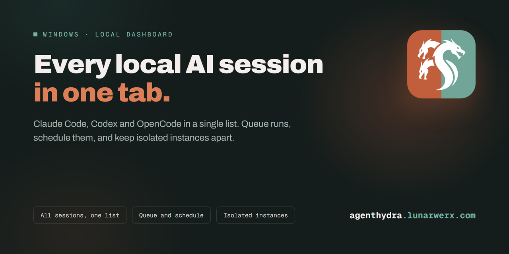
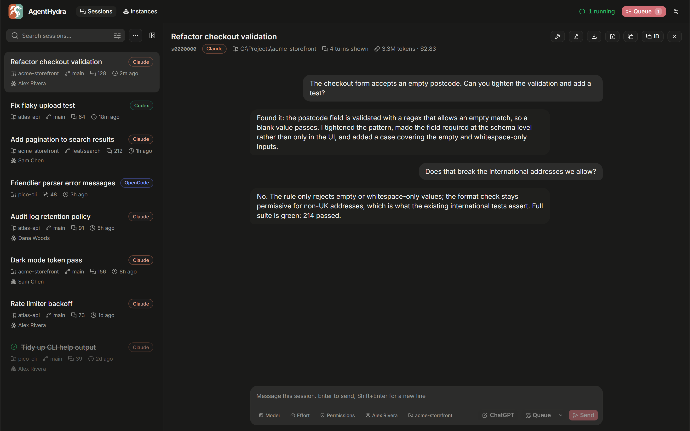
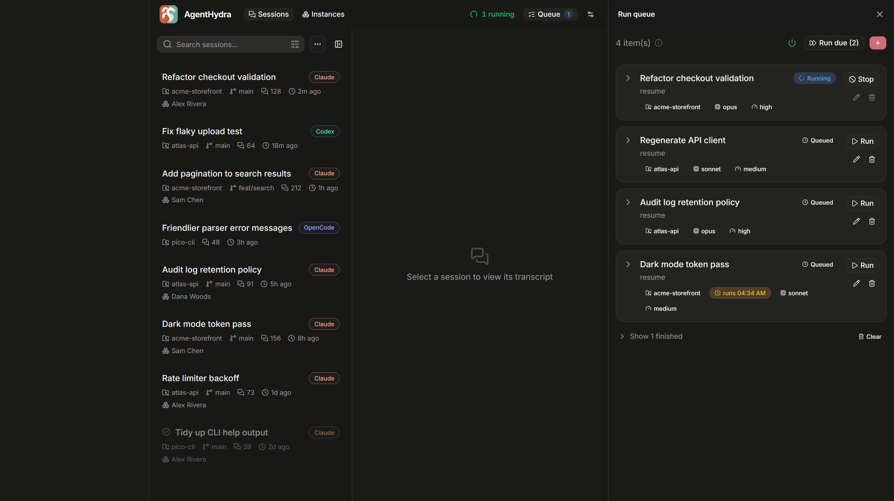
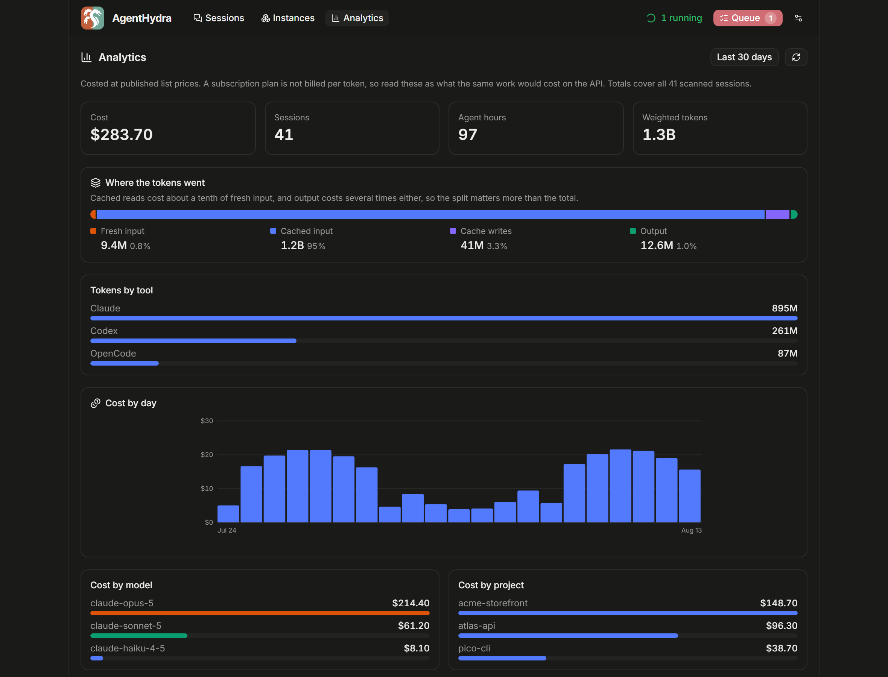
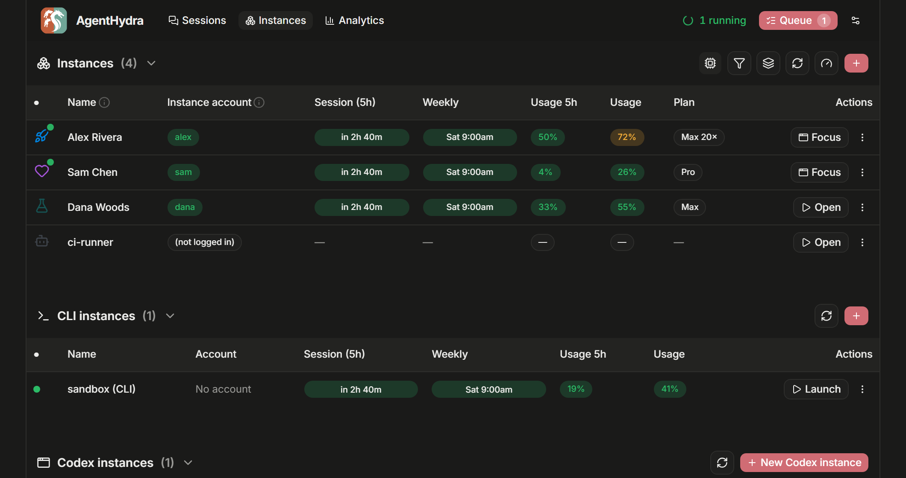

<div align="center">



### Every local AI session, plus your isolated Claude and Codex instances

[**Website**](https://agenthydra.lunarwerx.com) &nbsp;·&nbsp; [Download](https://github.com/LunarWerxs/AgentHydra/releases) &nbsp;·&nbsp; [Reference](docs/REFERENCE.md) &nbsp;·&nbsp; [Changelog](CHANGELOG.md)

[](https://agenthydra.lunarwerx.com)
[](https://github.com/LunarWerxs/AgentHydra/actions/workflows/ci.yml)
[](https://github.com/LunarWerxs/AgentHydra/releases)
[](LICENSE)

</div>

---

> ### CC Manager UI is now AgentHydra
>
> The name stopped being true. It manages Claude, Codex and OpenCode now, not just Claude Code, so
> it is named for the many-headed thing it actually is. Nothing about your install changes:
>
> - **Update normally.** GitHub redirects the old repo URL, so existing clones, remotes and the
>   built-in updater keep working without you touching anything.
> - **Your data comes with you.** `~/.ccmanagerui` is moved to `~/.agenthydra` on first run, with
>   the queue, settings, instance names and accounts cache intact. If the move cannot happen, the
>   app keeps reading the old folder rather than starting empty.
> - **Old env vars still work.** Every `CCMANAGERUI_*` variable is still read as a fallback for its
>   `AGENTHYDRA_*` replacement.
> - **What you should update at your leisure:** desktop shortcuts pointing at `CCManagerUI.exe`, and
>   any MCP config naming the old binary. Both are one-line changes.

If you run AI tools in more than one place (a couple of isolated Claude Desktop instances on
different accounts, Claude Code and Codex terminals across repos, or OpenCode CLI/Desktop), nothing
shows all of that local history at once. You alt-tab to remember which account is which, whether a
session is still going, and what you asked it to do.

AgentHydra is one local daemon that reads what is already on your machine and puts it in a single
browser tab. It is not a Claude client and it does not replace one. It is the dashboard the CLI and
the desktop app do not come with.

## Every session, in one list



<sub>Screenshots use demo data.</sub>

Claude Code, Codex, and OpenCode conversations on your machine appear together, newest first.
Filter by provider or recency; Claude sessions can also be filtered by project or Desktop instance.
Click one to read the conversation and live-tail it while it runs. Codex is read from its rollout
JSONL files, while OpenCode CLI and Desktop share the same local SQLite session store.

For Claude sessions, the box at the bottom lets you type straight back into a session without
finding its terminal. Pick several Claude sessions and you can send the same message to all of
them. Codex and OpenCode support is read-only.

An optional **ChatGPT handoff** in that composer turns the task and repository into a bounded
Markdown context file, copies a ready-to-paste prompt, and opens ChatGPT. AgentHydra omits common
secret files and likely credentials; you still review the attachment and submit it yourself.

When you want a raw Claude or Codex file, there is a button for opening the `.jsonl` in your editor,
downloading it under its real title, or copying it out. OpenCode conversations are rendered from its
database rather than exposed as a raw file.

## Queue work and let it run



Build a list of `claude` runs, each with its own prompt, working directory, model, effort,
permission mode and account. Run one on demand, or let the scheduler drain the queue for you, one at
a time or a few at once, with spacing so you are not hammering anything.

Anything you queue can be given a start time, so "do this at 3am" is a checkbox and not a cron job
you have to maintain.

Two things make this survive contact with reality:

- **Runs reattach after a restart.** Quitting the app, or letting it auto-update, does not kill
  what is in flight. It picks the runs back up.
- **A rate limit is not a dead end.** Sessions stopped by a 5-hour limit can resume themselves once
  the window resets, gated on your weekly usage so it does not spend everything the moment it can.
  This is off unless you turn it on.

## See where the time and the money went



Cost by day, by model, by project, and by the account that ran it. When in the week you actually
work. How many sessions were going at once. Which tools get used, which files changed recently, and
which sessions are worth a second look because a tool kept failing or the context was compacted.

All of it comes from totals worked out while the session list is being built, so it costs about half
a megabyte for a store of 1,400 sessions and no message text is kept. Costs are published list
prices: a subscription plan is not billed per token, so read them as what the same work would cost
on the API. `AgentHydra.exe --spend --json` prints the same numbers for a script.

## Manage isolated instances



If you keep separate Claude Desktop instances for separate accounts, this is where they live. Each
row shows which account it is signed into, its plan, and, while it is running, its process, memory
and uptime.

You can open, focus, quit, create and delete them from here, give each one a name, an icon and a
colour so they stop looking identical, and see your isolated CLI logins alongside the desktop
instance that shares their account.

The same view manages Codex Desktop and CLI together. Each Codex instance gets its own `CODEX_HOME`
and desktop profile, so work and personal OpenAI logins can run in separate Codex windows. Open,
focus and quit the desktop from its row; CLI Launch and Log in actions use that same isolated login.

### Quick instance mode

When you only need to pick an instance and start it, instance mode skips the session scanner,
database, queue recovery, scheduler, monitor, usage refresh, settings sync and updater. It opens a
compact portable window with Claude Desktop, Claude CLI and Codex start/focus/stop controls.

- Packaged build: run `AgentHydra.exe --instances`.
- Source checkout: run `bun run instances` (after the normal one-time `bun run build`).
- Windows shortcut: run `misc\Create-Shortcut.ps1` once, then open
  **AgentHydra Instances** from the repository root.
- Or add the same one-click launcher from **Settings → Appearance → Quick Instances shortcut**.

The quick daemon uses its own port and runtime pointer, so the full manager can open later without
conflict. If the full manager is already running, the launcher reuses it. Closing the quick window
retires its lightweight daemon automatically after a short reconnect grace period.

## Install

**On Windows, one line.** It installs under `%LOCALAPPDATA%` (no Administrator), and it verifies the
download against the release's published SHA-256 before unpacking anything, with no way to skip
that step, because a checksum you can opt out of is decoration:

```powershell
irm https://raw.githubusercontent.com/LunarWerxs/AgentHydra/main/install.ps1 | iex
```

It takes the ZIP, so you get the tray icon, and it makes a Start Menu shortcut. Read the script
first if you like; that is a reasonable thing to do with any `irm … | iex`.

**Or download** your OS build from [Releases](https://github.com/LunarWerxs/AgentHydra/releases).
On Windows, run the versioned `AgentHydra-…-windows-x64.exe` directly; it is an icon-bearing GUI
executable with the web app embedded and no console window. Linux and macOS builds remain
one-executable archives. No Bun is needed.

**Want the system-tray icon?** Take the Windows ZIP instead of the bare `.exe`, then run
`misc\Create-Shortcut.ps1` once and launch from the shortcut it creates. The tray icon comes from a
small separate launcher (`misc\lunarwerx-tray.exe`), so running `AgentHydra.exe` on its own never
shows one, and no in-app setting can change that. The ZIP doubles as the automatic-update transport.

**Or from source**, with [Bun](https://bun.sh):

```sh
git clone https://github.com/LunarWerxs/AgentHydra.git
cd AgentHydra && bun install
bun run build && bun run start
```

Either way the UI is at <http://localhost:7787>.

> **Just trying it?** Set `AGENTHYDRA_FAKE=1` and dispatch uses a harmless stand-in for the `claude`
> CLI, so nothing touches your quota or your repos. The scheduler is off by default. Note that
> instance actions (open / quit / create / delete) act on **real** Claude Desktop instances; delete
> asks you to type the name.

There is no cloud service behind this and no account to sign up for. It reads the local stores
your tools already write and talks to `localhost`; optional external handoffs open the provider
and leave the final upload to you.

**Update check.** The one thing that does leave your machine on its own is the periodic check for
a new release, against `studio.connections.icu` (a LunarWerx relay that mirrors GitHub's release
feed). It sends the app version, a coarse OS tag (e.g. `win11-26100`), and a random per-install id,
enough to count installs and see version/OS adoption. From that request, the server also derives and stores a coarse location (country, region, city,
timezone), your network's ASN, locale, and a truncated user agent, but never an IP address. It
never sends a hostname, username, file path, account, or email. Set `AGENTHYDRA_NO_PING=1` to opt
out; the update check then goes straight to GitHub's API instead, carrying no install id or
telemetry.

## Requirements

- **[Bun](https://bun.sh)** if running from source.
- The **`claude` CLI** for dispatch, and/or **Claude Desktop** for Claude instance management.
- Optional: **Codex Desktop/CLI** for isolated Codex windows, CLI launch/login, and local rollout
  history; **OpenCode** for local OpenCode history. Their sessions appear automatically when their
  standard local stores exist.
- **Windows** for the tray launcher. macOS and Linux builds exist and the instance-account code is
  written for them, but they are not verified there yet.
- **Windows instance management needs the classic Claude Desktop build** (the ~217 MB Squirrel
  `.exe` installer). The newer MSIX package cannot be launched with an isolated profile. The
  Instances tab detects this and links the right installer.

## For agents

The whole API is exposed over MCP, so any MCP-speaking client can inspect sessions and drive the
Claude queue, scheduler, and instance managers directly. Setup and the full tool list are in
[docs/REFERENCE.md](docs/REFERENCE.md).

Agents can also work out **which** of your accounts they are running as (`whoami`) and read that
account's remaining quota before fanning out work, which is the difference between pacing a big job
and hitting a wall halfway through it: [docs/AI_USAGE_SELFCHECK.md](docs/AI_USAGE_SELFCHECK.md).

## More

[Reference](docs/REFERENCE.md) covers configuration, the MCP tools, auto-update, the stack, the repo
layout and how to run the checks.

## License

[MIT](LICENSE).
