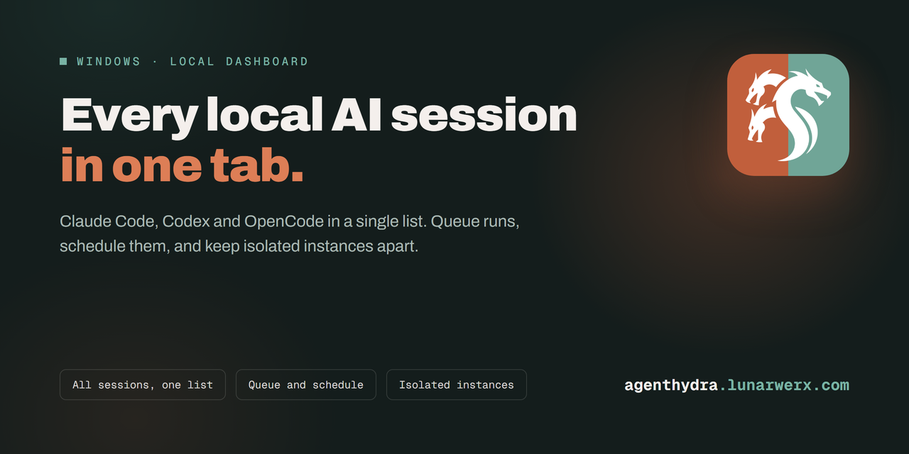
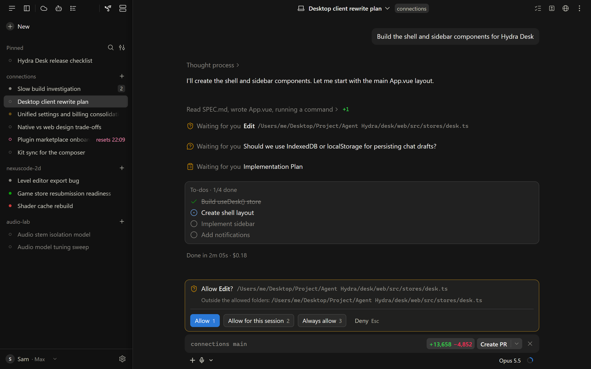
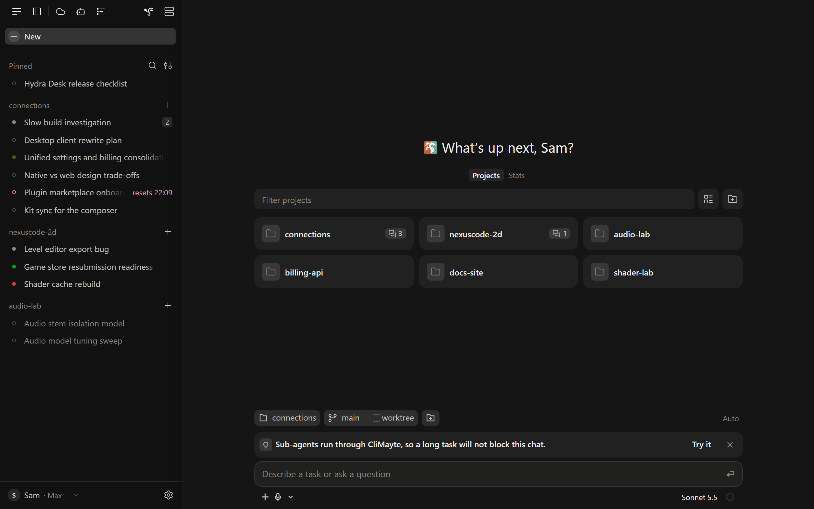
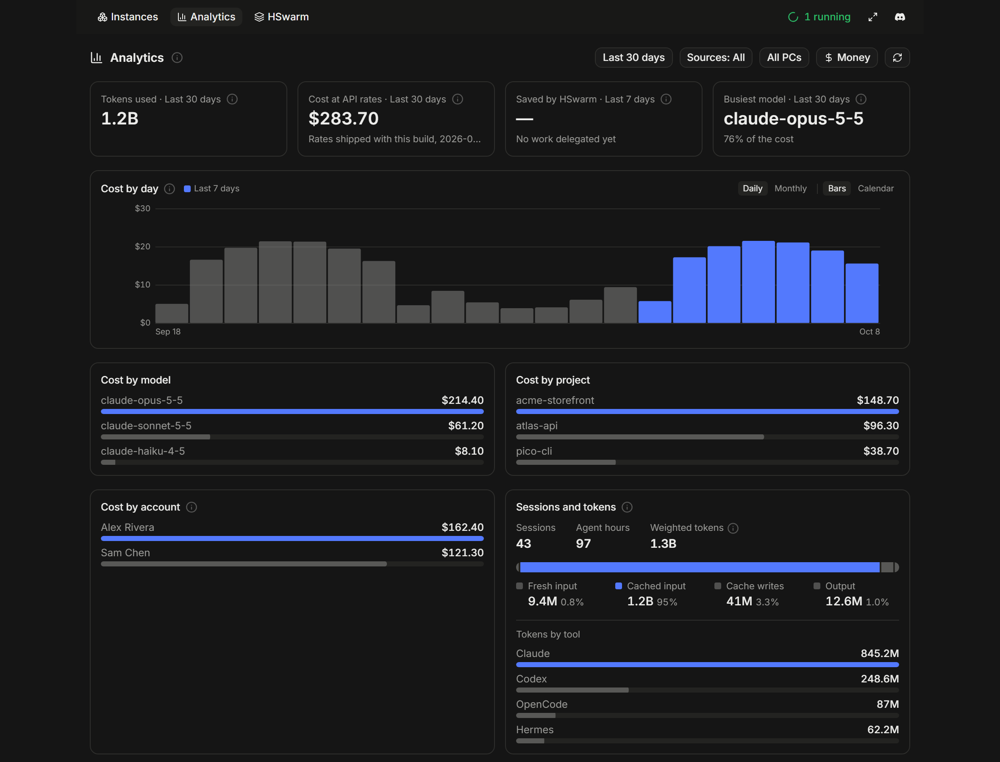
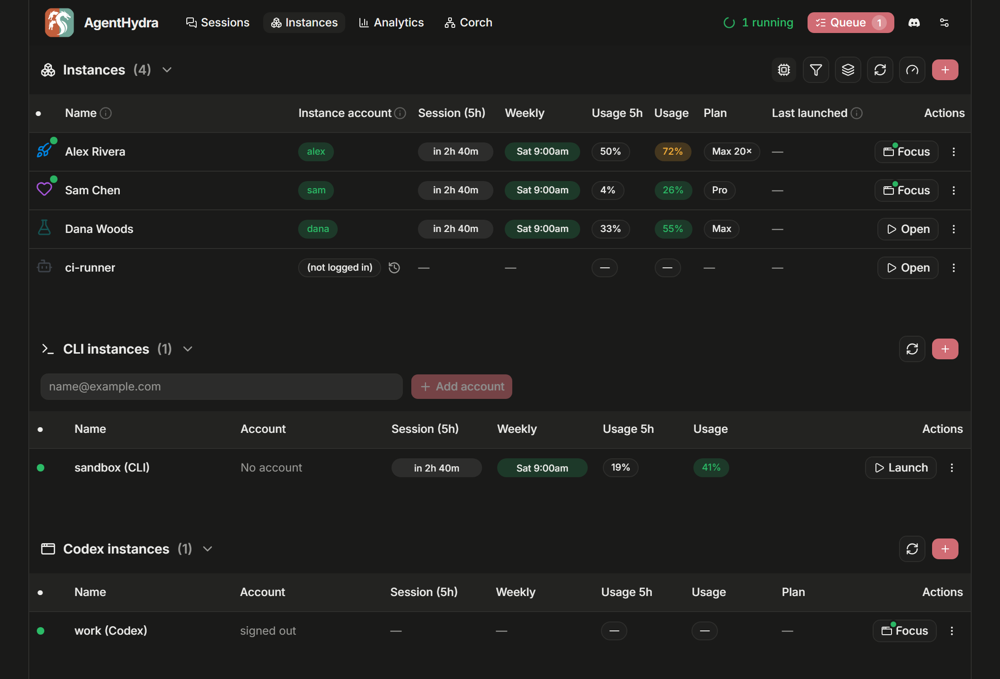

<div align="center">



### Every AI coding chat on your PC, and every Claude and Codex account, in one window

[**Website**](https://agenthydra.lunarwerx.com) &nbsp;·&nbsp; [Download](https://github.com/LunarWerxs/AgentHydra/releases) &nbsp;·&nbsp; [Reference](docs/REFERENCE.md) &nbsp;·&nbsp; [Changelog](CHANGELOG.md)

[](https://agenthydra.lunarwerx.com)
[](https://github.com/LunarWerxs/AgentHydra/actions/workflows/ci.yml)
[](https://github.com/LunarWerxs/AgentHydra/releases)
[](LICENSE)
[](https://discord.gg/PsWpeNUzhk)

</div>

---

AgentHydra is one local window over every AI coding session on your PC and every Claude and Codex
account you use. No cloud service, no sign-up.



<sub>Screenshots use demo data.</sub>

## TL;DR

- **Every chat in one sidebar:** AgentHydra's own Claude Code chats, Claude Desktop's and the CLI's, grouped by project, live while they run
- **New starts from your projects:** a grid with each one's git state and open chats, the busiest first
- **Dev servers built in:** start, stop and watch your projects' local servers, and open them beside the chat
- **CliMayte:** hand a task's pieces to your other Claude CLI accounts, and a worker moves on when one runs out
- **Where the time and money went:** cost by day, model, project and account, and what is wasting it
- **Every Claude and Codex account in one table:** plan, 5-hour and weekly quota, open, quit, create
- **For agents too:** the whole thing over MCP, including "which account am I, and how much is left"

<details>
<summary><b>Read more: what each part does</b></summary>

### Every chat, in one window

- The sidebar holds AgentHydra's own Claude Code chats (composer, permission prompts, to-dos, diffs,
  Create PR) beside your Claude Desktop chats and CLI sessions, grouped by project. Filter by app, or
  keep only what is running or waiting on you. With Login sync, your other PC's chats are there too.
- Codex and OpenCode conversations are listed and readable too; replying is Claude-only.
- **New** opens a grid of your projects, from Project Hydra, the folders you add and wherever your
  chats ran, each with its git state and how many chats are open in it. A chat started in a parent
  folder counts for the project it actually worked in, and is filed into that project's group.



### Dev servers, built in

- The Dev servers page lists your projects' local servers: start, stop, restart, logs, errors, CPU
  and memory, alerts. A browser pane beside the chat opens any of them.
- A folder needs no setup: it reads Claude Code's `.claude/launch.json`, or `package.json`'s dev
  scripts. (This was DevWebUI; it is part of AgentHydra now.)
- **ChatGPT handoff** packs the task and repository into a Markdown file (common secret files left
  out), copies a prompt and opens ChatGPT. You review and send it yourself.
- Open a raw Claude or Codex `.jsonl` in your editor, download it under its title, or copy it.

### Reply, fan out, or move a session, never headless

AgentHydra never runs a chat you cannot see: every run is in a real app window.

- **Reply** into a session's own desktop chat; it checks the message landed. A busy chat says so.
- **Fan out** a task list across your other signed-in accounts (MCP `fan_out`), one visible chat
  each, and steer them with `fan_out_send`.
- **Import** a session into a desktop app to continue it by hand.
- **Move** a chat to another account with `move_chat`, or several with `move_chats`. It keeps its
  history ([Moving chats between accounts](docs/MOVING-CHATS-BETWEEN-ACCOUNTS.md)).

The old run queue stays as a read-only record. Starting a new headless run is refused on purpose.

### CliMayte: hand a task's pieces to your CLI accounts

- A chat keeps the plan and hands each piece to a Claude Code CLI session on one of your accounts.
  When an account nears its limit, the worker moves to another and carries on.
- No console windows, but nothing hidden: every worker is readable and steerable in the CliMayte
  view, and its transcript is a normal session.
- **Quick add:** type an email, sign in in the window it opens, and the account is ready.
- **Two PCs:** with Login sync, each PC sees the other's CliMayte tasks and never crowds the same
  account. Desktop and AgentHydra chats can be shared too, view only.
- Over MCP: `climayte_run`, `climayte_status`, `climayte_send`, `climayte_cancel`, `cli_limit_reset`.
  Details: [docs/CLIMAYTE.md](docs/CLIMAYTE.md).

### Where the time and the money went



- Cost by day, model, project and account (at list prices: what the same work would cost on the
  API). When in the week you work, how many sessions ran at once, which tools were used.
- Why it cost that much: skills and MCP servers loaded and never used, calls past 150k tokens of
  context, what subagents spent, cache use per account, each with a one-line fix.
- Sessions worth a second look: a tool that kept failing, a compacted context, code that was gone
  from its files two hours later.
- **Recurring mistakes** pairs each failed shell command with the one that fixed it, and **Copy as
  rules** turns them into a rules file for your agents.
- `AgentHydra.exe --spend --json` prints the same numbers.

### Every account, in one table



- Each Claude Desktop instance with its account, plan, quota and process. Open, focus, quit,
  create and delete them, and give each a name, icon and colour.
- Codex Desktop and CLI the same way, each with its own login.
- **Claude native control:** turn on **Start debugger automatically** for an account
  (**Settings → Instances → Desktop**) and archiving and migration use Claude's own session
  manager ([guide](docs/CLAUDE-DESKTOP-NATIVE-CONTROL.md)).
- **Quick instance mode** (`AgentHydra.exe --instances`, or `bun run instances` from source) opens a
  small window that only starts and stops instances.

### For agents

- Everything is on MCP ([docs/REFERENCE.md](docs/REFERENCE.md)).
- `whoami` and the usage tools tell an agent which account it runs on and what is left, before it
  fans out ([docs/AI_USAGE_SELFCHECK.md](docs/AI_USAGE_SELFCHECK.md)).
- The **orchestrator** ([`orchestrator/`](orchestrator/README.md)) decides what should happen to a
  chat (sweeps, moves, archiving, naming), through the same MCP server and only while the tray icon
  is up. `orch.py policy` holds its switches.

### How it compares

Claude Squad and Conductor start new sessions in fresh git worktrees. AgentHydra starts nothing on its
own: it reads the history and account state your tools already write, and adds analytics and account
management on top. Cursor and Windsurf are editors; AgentHydra is a dashboard over the CLIs and apps
you already have.

</details>

## Install

**Windows, one line** (no Administrator; the download's SHA-256 is checked before anything unpacks):

```powershell
irm https://raw.githubusercontent.com/LunarWerxs/AgentHydra/main/install.ps1 | iex
```

**Or download** your build from [Releases](https://github.com/LunarWerxs/AgentHydra/releases), or run
from source with [Bun](https://bun.sh):

```sh
git clone https://github.com/LunarWerxs/AgentHydra.git
cd AgentHydra && bun install && bun install --cwd desk2
bun run build && bun run start
```

<details>
<summary><b>Read more: downloads, requirements, what reaches the network</b></summary>

- **Windows downloads:** the `.zip` (about 12 MB) holds the whole app: the new window, the tray icon
  and the orchestrator tools. The single `.exe` is a small launcher that fetches the rest of the app
  from the same release the first time you run it. Both self-update. The installer above takes the
  zip and adds a Start Menu shortcut. Linux and macOS get a `.tar.gz` (about 8 MB). No download packs
  Bun or Claude Code: the launcher fetches the Bun the release was built with on first run (checked
  against Bun's published checksums), and the new window fetches Claude Code when a chat first needs
  it, so you install neither yourself.
- **Requirements:** Bun only for a source checkout. The `claude` CLI and/or Claude Desktop for the
  Claude features. Optional: Codex Desktop/CLI, OpenCode, Hermes Agent, the DeepSeek Harness
  (`~/.dsh`), whose sessions show up when their stores exist. Windows for the tray; macOS and Linux
  builds exist but are not verified yet. Windows instance management needs the classic Squirrel
  installer of Claude Desktop, not the MSIX package (the Instances view links it).
- **Instance actions are real:** open, quit, create and delete act on your real Claude Desktop
  instances; delete asks you to type the name.
- **Network:** AgentHydra reads local files and talks to `localhost`. On its own it only checks for
  updates, through `studio.connections.icu` (a LunarWerx relay of GitHub's release feed), sending the
  app version, a coarse OS tag and a random install id; the server derives a coarse location and
  network ASN from the request, never storing the IP. `AGENTHYDRA_NO_PING=1` sends the check
  straight to GitHub with none of that.

</details>

## FAQ

<details>
<summary><b>Is it free?</b></summary>

Yes, MIT-licensed, with no account or subscription. You bring your own Claude Code, Codex or
OpenCode.

</details>

<details>
<summary><b>Can I try it without spending my Claude quota?</b></summary>

Yes. It never runs `claude` headless, and the scheduler is off by default. Instance actions still
act on real Claude Desktop instances.

</details>

<details>
<summary><b>Which AI tools does it support?</b></summary>

Claude Code, Codex and OpenCode sessions, in one list. Replies and moves are Claude-only; Codex and
OpenCode are read-only. Claude Desktop and Codex Desktop accounts are managed in the instances view.

</details>

<details>
<summary><b>I used CC Manager UI. What changes?</b></summary>

Nothing you have to do. The old repo URL redirects, `~/.ccmanagerui` moves to `~/.agenthydra` on first
run, and every `CCMANAGERUI_*` variable still works. Update shortcuts and MCP configs that name
`CCManagerUI.exe` when convenient.

</details>

Made by [LunarWerx Studios](https://lunarwerx.com). Also see [RepoYeti](https://repoyeti.com) and
[SageThumbs](https://sagethumbs.lunarwerx.com).
[Reference](docs/REFERENCE.md) covers configuration, the MCP tools, auto-update and the checks.

## License

[MIT](LICENSE).

## Star history

<a href="https://www.star-history.com/?repos=lunarwerxs%2Fagenthydra&type=date&legend=bottom-right"></a>
