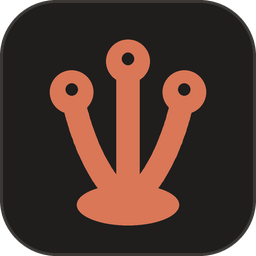

# Hydra Desk 2

Hydra Desk 2 is Michael's copy of Jacob's [Hydra Desk](../desk), made on 2026-10-04 to try new things
on without touching Jacob's app. It runs beside it: port 7798, data in `~/.hydra-desk-2/`, its own
window (`launcher/HydraDesk2.exe`, WebView2 data in `%LOCALAPPDATA%\HydraDesk2\webview`), and its own **Hydra Desk 2** shortcut
(`launcher/install-shortcuts.ps1`). Everything below is Hydra Desk's own description, with the ports
and folders changed to Desk 2's.

## What Desk 2 adds

A first, quick version of each, to see whether the direction is right. The layout is Desk's own: the
sidebar on the left stays put, and only the pane on the right changes.

- **Servers and a small browser beside the chat.** The title bar's Browser button opens a right pane (wider than Changes, drag its left edge to resize, the width is remembered) with this chat's localhost servers: a status dot, name, port, Start / Stop / Restart, the last output of one that crashed, and Start all / Stop all. Below it is a small browser for the server picked: address bar, back, forward, reload, open in the system browser. The servers come from DevWebUI (`../devwebui`), found through `DEVWEBUI_URL` or its `runtime.json` pointer and started hidden by `server/src/plugins/50-devwebui.ts` when the pane is opened and none answers (log in `~/.hydra-desk-2/logs/devwebui.log`; it keeps running when Desk 2 exits). A folder DevWebUI does not know yet gets one button that adds it. `/dw/api/*` goes on to the daemon only for Desk 2's own page, with DevWebUI's local credential added server-side; `GET /dw/status` says running, starting, stopped or failed. A Desk 2 server started before this existed shows "Restart Hydra Desk 2 to turn on servers".
- **AgentHydra inside the window, Desk 2's own copy of it.** The AgentHydra button in the chrome bar,
  after Back and Forward (an outline two-headed serpent drawn like the Cloud and Bot beside it), slides AgentHydra in over the chat with a push (0.42 s, the chat moving out
  to the left as AgentHydra comes in). While it is open there is still only the one sidebar, Desk's: on
  HSwarm it lists the tab's pages first (CliMayte, then HSwarm, `hydra/src/lib/hswarm-pages.ts`), and
  under the page on screen its own rows, CliMayte's task list or HSwarm's tree, drawn in Desk's look (the
  copy describes them in `shared/hydra-embed.ts` and hides its own; a click goes back to it); on every
  other tab the cloud list below. CliMayte has no tab of its own (owner, 2026-10-05: "move what is
  currently on the CliMayte tab into HSwarm ... and have it be on the sidebar as CliMayte"). CliMayte's
  waves move to the top of its task column. The copy has no Sessions
  tab: the cloud list is the session list, and a session clicked there slides the chat
  back and opens it in Desk's own view, under the session header below. A chat the copy itself is asked
  to open (the Instances move dialog's list, the landing page's session tiles) comes back to Desk the
  same way. Every other AgentHydra tab (Instances, Analytics, HSwarm) is there as usual.
  Escape, the AgentHydra button again, or picking one of Desk's own chats slides the chat back. The pane
  has no strip of its own above the copy (owner, 2026-10-05: "remove the header bar ... and remove the
  logo"): the copy's top bar fills it, without the AgentHydra logo and title or the Queue button. It
  opens at once: the copy loads in the background once Desk has painted and the window is idle, keeps
  every tab it has opened, and keeps one shared store per kind of data (CLI and desktop instances,
  analytics, HSwarm, CliMayte), asked again about every 2 minutes while the window is visible and
  right when a page or the pane is shown, so every tab reads the same numbers (`hydra/src/lib/warm-data.ts`).
  What slides in is not AgentHydra's own window but Desk 2's copy of it, `hydra/` (AgentHydra's `web/`,
  copied at 779aa0fd), so it can be changed as much as wanted without touching AgentHydra. Desk 2
  serves it at `/ah/` and hands its API calls to the one AgentHydra daemon (`HYDRA_URL`, default
  http://127.0.0.1:7787), only from Desk 2's own page and without the browser's cookies or origin; the
  daemon itself is not copied, since two would both run work on the same accounts. `bun run build`
  builds both windows.
- **The cloud list.** The cloud button (next to it, blue while it is on) turns the sidebar into every
  session AgentHydra knows, from both PCs: the desk list's rows plus the rest. Turning it on or off moves
  nothing (owner, 2026-10-04: "for some reason they change order"): both lists keep one saved order, so a
  row the desk list shows sits in the same group at the same place, and is there even when it is older
  than the cloud list's time period; the rows only the cloud list has come after the desk's in their group
  (and their groups after the desk's groups), each kept where it first appeared. Those rows lead with a
  cloud icon, their tooltip saying where they come from; a chat that came over from the other PC through
  AgentHydra's chat sync also shows that PC's name (the desk list marks it with the same cloud), and each
  row shows its AgentHydra instance number (#37), as AgentHydra's rows do. A row the desk list shows keeps
  its dot, and the dot moves as it does there: gray and pulsing while the session works, orange while it
  waits on you (owner, 2026-10-05: "the gray dots in the sidebar should pulse when they're working"). A session the desk list does
  not show goes under the folder it
  started in, which is where Claude Desktop files it, even after it moved into a subfolder. Clicking one opens its
  transcript on the right. Search looks through every session, archived ones included, from all time,
  and shows the best matches first. The cloud button again goes back to the desk list. It replaces
  AgentHydra's Sessions tab.
- **Rows that go away fade.** A row leaving either sidebar list, a CliMayte task line, or a folder whose last
  row left fades out and then folds shut, so the rows under it slide up instead of jumping (owner,
  2026-10-05). Rows a search or a filter hides go at once, and so does everything while the window is
  hidden or asks for reduced motion. Rows also stopped popping in and out: an outside session only
  AgentHydra's transcript index knows (a Codex session, a CLI outside `~/.claude`) stays listed for 10
  minutes after its last write, idle after the first 30 s, instead of leaving 30 s after each write, and
  HSwarm's job transcripts stay out of the desk list (HSwarm has its own tab), as they do in the cloud list.
- **Rows you arrange.** A row in either list drags to another place in its group (a line shows where it
  will land), into the one order both lists share; not while selecting, searching or filtering (owner,
  2026-10-05: "items in the sidebar need to be draggable to rearrange order"). A cloud list row has a
  right-click menu: a row the desk list shows gets its desk menu, any other Open, Pin and Copy session
  ID. A pinned outside session stays listed however long it has been idle. A row the desk list shows
  idle has the dimmer hollow ring, as Claude draws one, in the cloud list too. Motion is calmer: a
  working dot blinks every 2.4 s (was 1.2), a waiting one pulses every 3 s (was 2), and the sidebar's
  spinner turns once in 2.5 s.
- **Groups you hide.** A project group's header has a right-click menu with Hide: the group leaves the
  list and its chats stay active, nothing is archived (owner, 2026-10-05: "I don't want to like archive
  because they're meant to be there, but I also don't feel like seeing"). The Filter menu's Show hidden
  groups brings every hidden group back, dimmed with an eye-off mark, and its right-click then says
  Unhide. Both lists hide the same groups; a search still finds their rows, and opening a chat that sits
  in a hidden group turns Show hidden on. Pinned and Archived cannot be hidden. The browser remembers
  both (`web/src/components/sidebar/hidden.ts`).
- **Show only local, and a word on hover.** The Filter menu's Show only local (in the cloud list part)
  keeps just this PC's sessions, the ones synced from the other PC out; the Cloud list heading then reads
  "this PC". It is Computer with only this PC ticked, so either one undoes it. Every Filter menu item
  says what it does when the pointer rests on it (owner, 2026-10-05).
- **CliMayte tasks in the sidebar.** The robot button beside the cloud (blue while on) lists, under each
  chat or session in the sidebar that has CliMayte tasks running, those tasks, one short indented line
  each (status, title, model, how long it has run); a task a manager started sits one step further in,
  under its manager. A task with a session opens it; one without opens it on AgentHydra's CliMayte tab.
  Each task is listed once: a row that is itself a task (a manager's session in the cloud list) does not
  list its tasks again when they already show under the row that started it. A task sits only under the
  chat that spawned it, never in a list of its own (owner, 2026-10-04: "under the chat which spawned them.
  Not as its own stand alone table"): a task a manager's wave runs, which AgentHydra records with only its
  wave, goes under that manager, and the other PC's tasks (a little cloud, the PC in its tooltip) go under
  their chat when it is in the list, which takes that PC's chat sync and an AgentHydra there new enough to
  share the task's chat. However deep a chain goes, a running task still shows (past three steps in, at
  the third step's indent), and so does every finished task above it: the server keeps those past its
  "20 newest finished" cut. Turning it on while an AgentHydra tab with its own list is open slides back to
  the desk so the tasks show. Every task AgentHydra's CliMayte list shows running is in the sidebar
  (owner, 2026-10-05: "Is one smaller than six?"): tasks no row in the list started sit at
  the top, one heading per PC ("On <PC name>", "On this PC") with its running count. Under it, each chat that started
  them has a stand-in row (a chat icon, its title, an ⓘ on hover saying why it is there) with its tasks one step in:
  titled from that PC when its AgentHydra shares the chat's title, else "A chat on <PC> · <short id>"; a Desk chat
  run as a worker on that PC is its own stand-in, with its status and a click that opens it; "No chat" and "Unknown
  chat" (that PC's AgentHydra is too old to say) hold the rest. Once the chat is in the list, its tasks move under
  it. The other PCs' tasks show only while the cloud is on. A folded group's heading
  carries a blue dot with how many CliMayte tasks run under it and a green dot with how many of its chats
  run (owner, 2026-10-05).
- **HSwarm jobs in the sidebar.** While the robot button is on, a chat's row also lists the HSwarm jobs it
  started, after its CliMayte tasks (owner, 2026-10-05: "ZSwarm threads should also be displayed on the
  HydraDesk 2 sidebar"). Desk 2's server reads them through AgentHydra at most every 10 s
  (`GET /api/swarm/jobs`, `server/src/bridge/swarm.ts`) and the page polls them while the toggle is on
  (`web/src/lib/swarm-jobs.ts`); a running job whose chat is not drawn goes in the block at the top.
- **The sidebar is there at once.** Opening or reloading the window shows the last known lists straight
  away (kept in the browser), and the server sends a new window every list it has as soon as it joins,
  instead of waiting for the next change.
- **The session header.** Over a session opened from the cloud list (or any session running outside
  Desk) sits one bar, across the whole pane, with what AgentHydra's Sessions tab said about it, each
  fact in its own colour: the product, the short id (click to copy), the instance number and account
  (its address in the tooltip; click to see that account's row in AgentHydra's Instances, the desktop or
  CLI table, marked), the folder (click to open it), the git branch, turns,
  tokens and cost (the breakdown in the tooltip; a "+" when a model has no published price), the model
  and effort, and any credentials the transcript printed (redacted). Its buttons are Find (Ctrl + F;
  Enter and Shift + Enter step through the matches, marked in the transcript), Copy session file
  location, Copy session id and Close, and its ⋯ menu has the account (bring it to the front, copy its
  address), Display (only what I typed, tool activity, reasoning, compact layout), the session file
  (open it, save it as Markdown, a web page or the raw .jsonl, copy the file itself, copy its path), and
  for Claude sessions Reopen in a terminal and Migrate to another account. The title bar's panel icon
  slides it up out of view and back down; it lies over the top of the transcript, so the page never
  re-lays out while it moves. The chat title in the title bar is centred. It reads AgentHydra through
  Desk 2's `/ah/api`.
- **The copy's own changes.** Its desktop Instances table keeps its column widths and row order while
  the stats load (fixed columns, placeholders the size of what replaces them; Memory and Tokens re-sort
  on a header click or Refresh, not on every poll), and an HSwarm job opens its summary right under its
  row instead of at the bottom of the page. A CliMayte task's pane shows its whole title and, first in
  its body, the whole brief it was sent (the daemon's `GET /api/corch/workers/:id?prompt=full`; lists
  and MCP still get the first 300 characters). The centred column has no side lines.
- **Every source in the home screen's stats.** The stats card under "What's up next?" counts everything
  AgentHydra knows, not only Desk's own chats (owner, 2026-10-04: "full consolidated stats from all
  sources"): sessions, messages, tokens, active days, peak hour, favourite model, CliMayte's tasks,
  HSwarm's tasks and the cost at API rates, then one line per source (Claude desktop, the CLI, CliMayte,
  HSwarm, Codex, OpenCode, DeepSeek) and the activity grid, for All, 30 days or 7 days. Desk's server
  gathers it in one route, `GET /api/stats/home?range=`, from AgentHydra's spend and activity reports,
  CliMayte's totals and HSwarm's stats; a part that does not answer shows a dash saying why, never a 0,
  and with AgentHydra away the card shows Desk's own chats and says so. Each square of the activity grid
  says its day and its number on hover (owner, 2026-10-05), and the Sources list folds up: folded at
  first, then as you last left it.
- **Background tasks, as the real app shows them.** The Background tasks panel works for a session
  running outside Desk too (owner, 2026-10-05: "it currently says, 'No running, no finished,' but there
  actually is one running and one finished"): it lists that session's running and finished background
  tasks, a failed or stopped one with an X, and keeps asking while one runs, even when the session itself
  is idle. The title bar's list button, beside the session header's panel button, opens the panel, for
  Desk's own chats too, with a blue count while tasks run (owner, 2026-10-05: "the one that shows me,
  like, background running tasks. Which I have not been able to figure out how to view").
  A chat's finished tasks count under Finished, in Desk's own chats too. The count lives in one
  place, the muted "1 running task · 2 finished" line under the last message; the agents chip that
  repeated it above the composer is gone. A workflow that finished before the latest turn began (a
  finished background task starts a turn of its own) folds into one muted line, as in the real app,
  instead of keeping its card.
- **A CliMayte move reads as one line.** When CliMayte moves a chat to another account, the chat shows
  "CliMayte moved this chat from #164 to #153." and nothing else for it: the prompt the new session was
  started with (the task again, a note to it and the whole handoff) is never shown as your message. A
  handoff with no move (same account) is one muted "Continued in a fresh session" line; messages you sent
  that the earlier session never got to stay as yours. Chats already saved read the same way.
- **Restart to update.** When Desk 2's server code changes after it started, the Menu button gets a blue
  dot and Menu has Restart to update: it runs `launcher/restart.ps1` for you, the chats keep running and the
  window reconnects. A button that needs newer server code than the running one says so instead of a bare
  "no route" (2026-10-05: Send now, Fork and the servers pane each looked broken until a restart).
- **Small things that stay put.** Closing the tip over a new chat's composer ends the tips for good
  (owner, 2026-10-05: "Those all need to remember if I close them and stay closed"). Over an outside
  session, the line about continuing it says what happens: it continues as a copy on the account CliMayte
  picks when you send, and the original stays as it is. That line now sits clear of the composer below it.
- **A working Claude Desktop chat stays usable.** Over a Desktop chat that is working or waiting on you,
  the composer stays (owner, 2026-10-05: "don't remove the box and just tell me it's working in the
  desktop ... I need to be able to type in it"), under a line saying what the chat is doing. What you send
  goes into that chat's own queue through AgentHydra (`POST /api/external/sessions/:id/message`, on to
  the daemon's `POST /api/sessions/:id/message`) and runs when its turn ends; until the transcript shows
  it, it is listed as queued. Text only: files, pictures and voice are off there. An idle chat still
  continues as a copy, as above.
- **Its own window, opening where you left it.** Desk 2 opens in its own native window,
  `launcher/HydraDesk2.exe` (WebView2, built from `launcher/host`), instead of an Edge app window
  (owner, 2026-10-05: "It loads and then it auto-adjusts itself on the screen ... I want it to load in
  the position that I last left it"). The window is created hidden at the place saved in
  `~/.hydra-desk-2/window.json` (the rectangle it had on screen, so a snapped window comes back on the
  same spot, and maximized if it was), shown once, and never moved after; a saved place whose title bar
  is no longer on a connected monitor falls back to a default on the main one. Its title bar is drawn in the page's background colour, so
  it no longer shows black above it. Its WebView2 data lives in `%LOCALAPPDATA%\HydraDesk2\webview`; on
  the first run the launcher asks the old Edge app window to close and the host copies the page's saved
  settings (the sidebar order and filters among them) from the old window profile.
- **Desk's chats, brought over.** `POST /api/chats/import-desk` (body `{}` for every chat, or
  `{"ids": [...]}`) copies Hydra Desk's own chats (`~/.hydra-desk`, or the folder `HYDRA_DESK_IMPORT_FROM`
  names) into Desk 2 while both run: each chat Desk 2 does not have yet, as Desk saved it (title, folder,
  account, CliMayte worker, archived), with its transcript and the pictures it names. A chat already here
  is left alone, so running it again adds only the new ones (owner, 2026-10-05: "I would love for all of
  these to be transferred to Hydro Desk 2"). A CliMayte chat is the same worker in both windows, so a
  message from either continues it. A chat Desk moved to a fresh session keeps its earlier sessions as its
  own, so they are not listed again as outside sessions, and a chat changes folder as in Desk: only when
  its session really relocated, never for a moment's cd into the home folder.
- **More in the Filter menu.** The sidebar's Filter button now holds what AgentHydra's Sessions ⋯ menu
  has: Refresh, Only this view, Select multiple sessions, then Source, Instance, Queued work, Usage
  limits, Session shape, Archived, Computer and Time period, Reset, and Session settings (which opens
  AgentHydra). The desk list's own filter is still at the top of the same menu.

The server side is two read-only routes over AgentHydra's: `GET /api/cloud/sessions` (the same scope
parameters as AgentHydra's `GET /api/sessions`) and `GET /api/cloud/instances`.

---



Hydra Desk is Jacob's own Claude Code desktop: a replacement for the Code tab of Claude Desktop. It
runs Claude Code chats itself, through the Claude Agent SDK, and shows at a glance which chats are
working, which are waiting on you, which finished and which stopped. You can stop any of them from the
window. It also shows the CliMayte workers AgentHydra is running and the Claude chats running
elsewhere on the PC. It looks like Claude Code Desktop in its dark theme; the one deliberate difference
is that it never hides whether a chat is working.

The full design is in [SPEC.md](SPEC.md). The contract between the server and the window is
[shared/protocol.ts](shared/protocol.ts).

## Starting it

**The shortcut.** Run `launcher\install-shortcuts.ps1` once. It puts a "Hydra Desk" shortcut on the
Desktop and in the Start Menu. Clicking it starts the server in the background if it is not running,
waits for it to answer, then opens Hydra Desk in its own window (`launcher\HydraDesk2.exe`, which needs
the WebView2 runtime that ships with Windows 11), with its own taskbar entry. Clicking it again just brings the window forward; it
never starts a second server. No console window appears: the shortcut runs `launcher\start.vbs`, which
runs `launcher\start.ps1` hidden.

```powershell
powershell -NoProfile -File launcher\install-shortcuts.ps1   # make the shortcuts (-DryRun to preview)
powershell -NoProfile -File launcher\start.ps1               # what the shortcut does (-DryRun to preview)
powershell -NoProfile -File launcher\stop.ps1                # stop the server the launcher started
```

`stop.ps1` stops only the server `start.ps1` started (by the pid file it wrote), together with the
Claude Code processes its chats were running. It never touches any other bun process.

If the server does not answer within 20 seconds, the launcher shows a message box with the end of the
server log.

**For development.** `bun install`, then `bun run dev` runs the server with reload on 7798 and the Vite
dev server on 4798 (open http://127.0.0.1:4798). `bun run build` builds the window into `web/dist`,
which the server on 7798 serves; the launcher's window needs that build. `bun test` and
`bun run typecheck` are the checks.

To regenerate the icon: `python launcher\make-icon.py` (needs Pillow), then re-run
`install-shortcuts.ps1` so Windows picks it up.

## Ports

| Port | What |
| --- | --- |
| 7798 | Hydra Desk server: the API, the `/ws` live updates and the built window (`HYDRA_DESK_PORT` overrides) |
| 4798 | Vite dev server during `bun run dev`, forwarding `/api` and `/ws` to 7798 |
| 7787 | AgentHydra's daemon, which Hydra Desk talks to (`HYDRA_URL` overrides) |

## Where data lives

- `~/.hydra-desk-2/` (set `HYDRA_DESK_HOME` to move it; every test points it at a temp folder):
  - `settings.json` your settings
  - `chats.json` the chat list, and `chats/<chatId>.jsonl` each chat's transcript
  - `logs/server.log` the server's output, `logs/launcher.log` what the launcher did,
    `logs/<chatId>.log` each chat's Claude Code log
  - `server.pid` the server the launcher started (read by `stop.ps1`)
  - `window.json` where the window was last left (written by `launcher\HydraDesk2.exe`)
- `%LOCALAPPDATA%\HydraDesk2\webview` the window's WebView2 data (the page's saved settings live here).

## The SDK

Chats run through `@anthropic-ai/claude-agent-sdk` 0.3.288. Each chat is a long-lived SDK session with
your Claude Code settings, CLAUDE.md files, hooks and MCP servers loaded as Claude Code would load them.

## How it plugs into AgentHydra

AgentHydra is the daemon on http://127.0.0.1:7787 (the parent folder of this one). Hydra Desk reads from
it, and works without it:

- **Accounts.** A new chat runs on the signed-in Claude account with the most room left, picked from
  AgentHydra's accounts, or on your default login.
- **CliMayte.** Every chat gets AgentHydra's MCP server, so it can hand work to CliMayte workers on any
  account. The CliMayte panel lists the workers running now, and each chat shows how many of its own
  workers are active.
- **Elsewhere.** The chats running in Claude Desktop or the Claude CLI show in their own list with
  their status, and you can adopt one into Hydra Desk.

If AgentHydra is not running, the window says so in a banner and those lists stay empty; your own chats
keep working.

This folder is part of AgentHydra's public repo: everything committed here is published.
