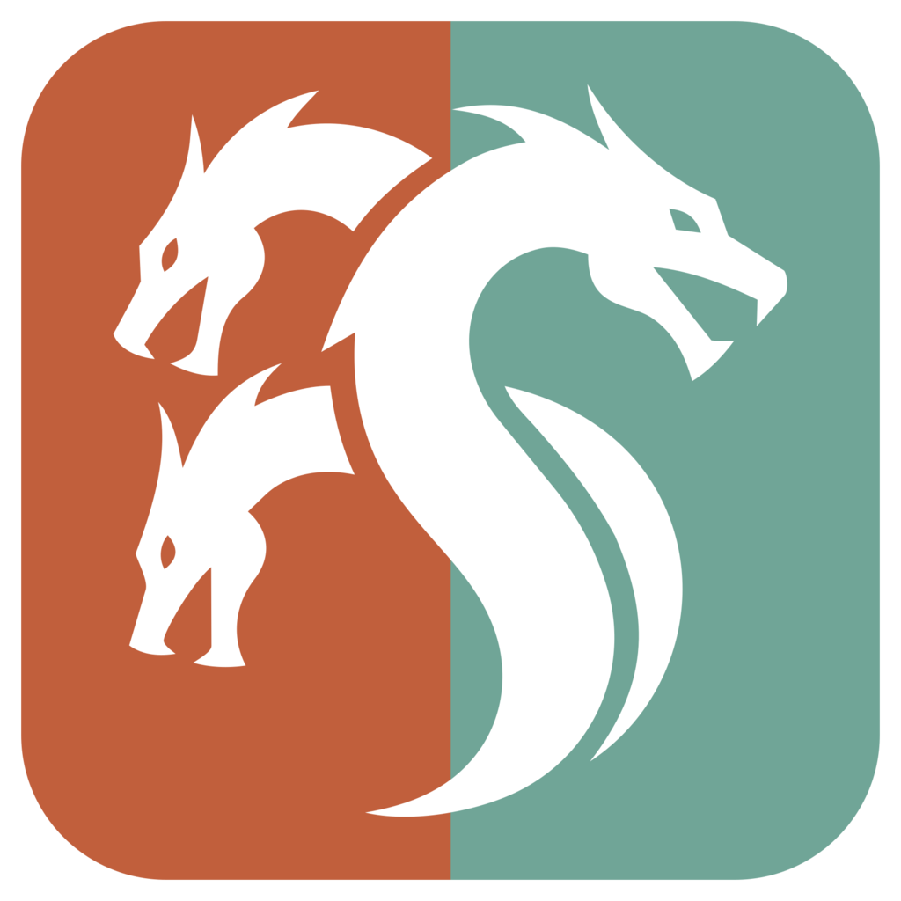

# AgentHydra 2.0 (Hydra Desk 2)

AgentHydra 2.0 is AgentHydra's window (it was Hydra Desk 2): your chats on the left, the open chat on the
right, and AgentHydra's accounts, CliMayte and HSwarm pages inside it.

## TL;DR

- **Every chat in one sidebar:** this PC's and your other PC's, with CliMayte and HSwarm work as badges
- **AgentHydra inside the window:** accounts and quota, CliMayte, HSwarm, analytics, one Settings dialog
- **Dev servers run once for everyone:** AgentHydra runs each project's dev servers in its own small background
  process, reuses one that already runs (whoever started it) instead of starting a second, and gives every chat tools for it
- **Servers and a small browser beside the chat**
- **Its own title bar:** drag the window from any empty part of the top row, AgentHydra's pages included, and
  Maximize offers Windows 11's snap layouts
- **A working line like Claude Desktop's:** what the turn is doing now, the time since your last message, and a
  ">" that opens that step
- **A Dev servers button in the title bar:** the sidebar lists the projects and their servers by company, folded to what runs; a click opens its details on the Dev servers page, which slides in like AgentHydra's, and the list scans for, adds and edits projects
- **Git through RepoYeti:** commit, push, pull, branch and Create PR, and one Changes tab
- **Connectors** for RepoYeti, ReDesign and Connections, without copying them in, and the built-in Dev servers
- **Free claude.ai and ChatGPT accounts** that can take work
- **A babysitter for usage limits:** a chat a limit stopped, here or in Claude Desktop, is continued once the limit resets
- **Videos and pictures play in the chat**
- **Start it** from the AgentHydra shortcut or the tray's Open ([Starting it](#starting-it))

This folder is AgentHydra's window: AgentHydra 2.0, called Hydra Desk 2 until 2026-10-06 (owner: "HydraDesk
is no longer called HydraDesk. It is now called AgentHydra"). Its window, its **AgentHydra** shortcut
(`launcher/install-shortcuts.ps1`, which also sends the old "Hydra Desk 2" shortcuts to the Recycle Bin)
and its messages say AgentHydra; the folder and the internal names keep Desk 2's: `desk2/`, port 7798,
data in `~/.hydra-desk-2/`, the window host `launcher/HydraDesk2.exe` (WebView2 data in
`%LOCALAPPDATA%\HydraDesk2\webview`). The daemon on 7787 no longer shows the old window where this folder
is beside it: a page asked of it goes on to this window (`server/src/index.ts`, `DESK2_URL`).

It began as Michael's copy of Jacob's Hydra Desk (`desk/`, retired from this repo on 2026-10-07; its history keeps it), made on 2026-10-04 to try new things on
without touching Jacob's app. Everything below is Hydra Desk's own description, with the ports and
folders changed to Desk 2's.

## What Desk 2 adds

<details>
<summary><b>Read more: everything Desk 2 adds</b></summary>

A first, quick version of each, to see whether the direction is right. The layout is Desk's own: the
sidebar on the left stays put, and only the pane on the right changes.

- **The orchestrator: a plan, and once armed a frontier model judges each chat** (owner, 2026-10-07: a lighter orchestrator that runs through AgentHydra and replaces the old one). Settings > Diagnostics > Orchestrator lists every open chat active in the last 3 days, Desk's own and the outside sessions AgentHydra knows (Claude Desktop, CLI, CliMayte, Codex; a question there is an AskUserQuestion call still running, and one that waits in its own window is left to a person), with the one move the orchestrator would make next and why: answer its question card, answer the NEED line or "want me to ...?" its last reply ended on, retry after an error, resume after a usage limit, watch it, or leave it to a person (a person wrote in it in the last 10 minutes, or it waits on a permission, a plan or a form only a person grants). "Ask the CreAitor" (shown when this machine has the owner's CreAitor tool where `server/src/orchestrator/creaitor.ts` looks for it, or `HYDRA_DESK_CREAITOR` names it) adds what the owner would answer each waiting question, from the owner's past decisions, or that only the owner can. `GET /api/diagnostics/orchestrator` (`?days=`, `?ask=1`; plugin `70-orchestrator.ts`, own page only; contract `shared/orchestrator.ts`) reads the engine's own routes and sends nothing; the move rules are `server/src/orchestrator/plan.ts`. **Arm** (phase B: Settings > General > Orchestrator, beside the Babysitter's switch, or `POST` the same path `{ "armed": true }`; the `orchestrator` setting, off by default and kept until turned off, owner 2026-10-09: "I may not always want the foreman on ... but sometimes I might want it on") makes it act: every minute it looks at Desk's own chats and the Claude Desktop sessions it can see, and asks a frontier model to judge each one that is due a look (`server/src/orchestrator/judge.ts`; owner, 2026-10-09: "essentially a frontier-level AI that is doing the managing, not just some basic heuristic stuff"). Due means a running chat not judged in the last 10 minutes, and every Desk chat an error stopped. The model is the `orchestratorModel` setting (Settings > General > Watching chats: Opus, Sonnet or Haiku, each the newest of its line, or a full model id; the default is Opus, and the page shows the id the SDK reports it resolved to). The call goes through the Agent SDK with no tools, one turn, no MCP servers, no permission prompts, and a 90-second timeout, signed in with any account AgentHydra lists that has room, whichever account the judged chats run on (owner, 2026-10-09: "just use ... anything that's available"): one nobody is using first, the least used first, then a busy one, and the next (up to three) only when a login is refused; the default `~/.claude` login (see ../docs/CLAUDE-CONFIG-LAYOUT.md) comes last. It answers one JSON object: `fine` (send nothing), `nudge` (a check-in note), `continue` (carry on after an error), `leave` (only a person can move it) or `more` (a longer slice of the transcript, please), with the message to send and one sentence on why. Its brief is the chat's first message, the newest slice of its transcript (about 1% of it, between 12 000 and 40 000 characters; each `more` reads about 3%, then 5%, capped at 250 000; `server/src/orchestrator/judge.ts` `CONTEXT_STEPS`), how long it has been working, the rule signals (spinning, hung, stalled, an error, a question or NEED line), and the notes and continues it already got this hour. The rules are its inputs and its limits, not its decision: it never writes into a chat a person wrote in within 10 minutes, never acts on a usage-limit stop (the babysitter's, below), sends at most two check-in notes an hour to one chat, bounds continues by the retry limit, and a Disarm stops it before its next send. A stalled chat is judged and flagged on the page only. At most three chats are judged at once. A failed call sends nothing and shows its error on the row; there is no fallback text. Each judgment shows on its plan row (model, verdict, why, time), and what it sent is listed under "What it did" (`server/src/plugins/70-orchestrator.ts`, `server/src/orchestrator/act.ts`).Outside sessions stay plan-only, choosing and handing out work stays with the board a runbook chat works through (to the orchestrator, a chat like any other), and phase C sends the CreAitor's answers into the chats once they are proven.
- **The babysitter: chats a usage limit stopped are continued once the limit resets** (owner, 2026-10-08: "every five minutes ... check if ... Claude hit its limit while there were threads running ... how many, which ones, when does it reset ... then, when the limit is lifted, go resume all of the paused ones"; built new for AgentHydra 2.0, not the old daemon's auto-resume monitor). It is on by default (Settings > General > Babysitter, `DeskSettings.babysitter`) and asks no model: every 5 minutes, and again as soon as a reset it knows of passes, it reads Desk's chats, the outside sessions, the accounts and the send queue through Desk's own routes. It watches Desk's chats whose status is `limited` and Claude Desktop sessions whose transcript ends at a usage-limit notice (the daemon's `limit_stop`, with `resets_at` read from the notice against the moment of the stop); a stop once seen is remembered past the daemon's 24-hour index, for a weekly limit. Once the limit has reset (a minute after the named reset, or 5 hours after the stop when none was named; a Desk chat on auto goes as soon as an account has room), it sends one "continue" note, never shown as the person's message: a Desk chat's through its send queue, a Desktop chat's through `POST /api/external/sessions/:id/message`, which AgentHydra delivers through the running Claude app's own chat-to-chat messaging (the native send, docs/CLAUDE-DESKTOP-NATIVE-CONTROL.md), which starts a stopped chat again by itself, and over the chat's peer pipe only when the app cannot be reached; never by typing into its window. A Desktop chat AgentHydra cannot reach (its app closed, AgentHydra not answering) is not counted and is tried again on the next look; a CLI session is listed but only its own terminal can continue it; Codex, CliMayte workers and the other PC's chats are left alone. A chat that stops again at once after three continues in a row is left to a person, and one that stops anew later is counted afresh. `GET /api/babysitter` (`?fresh=1` looks first) answers from its last look: each stopped chat with its account, stop, reset, state and reason, the stopped count and soonest reset per account, and the last 50 things it did; `POST /api/babysitter { enabled?, check? }` turns it on or off or looks now. The daemon's MCP tool `babysitter` reads the same. Its memory is `~/.hydra-desk-2/babysitter.json`, so a restart neither forgets a count nor sends a continue twice (`server/src/plugins/72-babysitter.ts`, judgment `server/src/babysitter/decide.ts`, contract `shared/babysitter.ts`).
- **An archived chat says so at its bottom, with a link to unarchive it** (owner, 2026-10-06: "So I know the chat I'm in is archived"). Open an archived Desk chat or outside session and a slim line between the transcript and the message box reads "This chat was archived. Click here to unarchive."; the link does what the row menu's Unarchive does, and a failure shows the same way. It appears the moment the open chat is archived from the sidebar or the header menu, and goes when the flag flips (`archivedNotice` in `web/src/components/shell/logic.ts`).
- **A chat playing sound shows a speaker on its sidebar row; one click mutes just that chat** (owner, 2026-10-06, like a browser tab). A video in the chat, or a page tab of its browser pane in AgentHydra's window, playing with sound puts a speaker at the row's right end, left of the three dots; clicking it (or Mute chat in the row's menu) mutes that chat's videos and page views, and the speaker becomes a muted one. The state is `web/src/lib/chat-audio.ts`; it lasts while the window runs. A chat's browser tab that plays sound keeps playing in the background when you switch chats (hidden, its row keeps the speaker, and the speaker mutes it without opening the chat); coming back shows the same live page. It closes when its tab is closed, its chat is archived or deleted, or it has been silent for 60 seconds; at most 6 are kept (`web/src/components/servers/background-views.ts`).
- **Videos play in the chat** (owner, 2026-10-06: "I don't have to click it. It literally shows the video"). A reply that writes ``, or sends one with SendUserFile, shows the video in place, playing muted and looping like a GIF, with its own controls for sound, seeking and full screen; pictures and GIFs already showed the same way. mp4, m4v, mov and webm up to 200 MB, checked by their first bytes, are copied into the media cache (`server/src/media/cache.ts`, keyed by path, size and modified time, so a long recording is never read whole), and `GET /api/media/:id` answers byte ranges so the player can seek. A file the reply only names is shown too: a picture or video written as `packages/ugc/out/ads/claude.mp4` in backticks, bare in prose or as a link, absolute or relative to the chat's folder, appears under the reply (`namedMedia` in `server/src/engine/normalize.ts`, the item's `media`), at most 8 a message and only files the cache accepts. Every chat is told how: the SDK prompt (`server/src/engine/desk-prompt.ts` MEDIA) and AgentHydra's chat note for CliMayte chats (`../server/src/climayte-launch.ts` CHAT_NOTE).
- **Connectors: outside apps hooked in without copying them** (owner, 2026-10-06). RepoYeti, ReDesign, DevWebUI and Connections each are a file in `server/src/connectors/defs/` (`ConnectorDef`, `server/src/connectors/types.ts`; contract `shared/connectors.ts`). `server/src/connectors/registry.ts` polls every connector's `detect()` every 15 s and after any action, keeps the last status, and `GET /api/connectors` (plugin `57-connectors.ts`, own page only) lists them; `POST /api/connectors/<id>/<install|start|enable|disable>` runs an action. Settings → Connectors shows one row per connector: a status dot and word, its version, Install, Start, Open (a pane connector that runs), a homepage link, and the switch "Give chats its tools" (kept in `~/.hydra-desk-2/connectors.json`). Install downloads the release asset of the connector's GitHub repository into `~/.hydra-desk-2/apps/<id>/` (`server/src/connectors/release.ts`) and runs nothing that does not match its line in the release's `SHA256SUMS.txt`; start is hidden, and an enabled connector that is installed starts by itself, hidden, when Desk starts (and when its switch is turned back on), so chats get its tools without a click. While a connector runs and is enabled, every chat started afterwards gets its MCP servers (under the person's own config of the same name; AgentHydra's still wins) and one prompt paragraph after Desk's own. Dev servers (id `devwebui`) is built in, so there is nothing to install: while it is enabled every chat gets its `devservers` tools and prompt paragraph (below), and its row shows the dev-servers service with Restart and Stop.
- **The git bar above the message box runs through RepoYeti** (owner, 2026-10-06). The project, branch and +N -N stay as they were. While RepoYeti runs, the Create PR split button becomes one control (`composer/RepoYetiActions.vue`, pure logic in `repoyeti-bar.ts`): a primary button plus a menu with Commit (a message box prefilled from RepoYeti's drafted message, Amend as an option), Push and Pull (with ahead/behind), switch or create a branch, Undo / Redo of the last git action (RepoYeti's reflog; its preview is the confirm text), Open in RepoYeti, Create PR and Undo this chat's changes. Desk's server makes the calls (`server/src/plugins/59-repoyeti-git.ts`, `/api/repoyeti/git/*`, own page only, only while the connector runs) over RepoYeti's REST API, never its MCP tools, which wait for approval in RepoYeti's pane. RepoYeti has no pull-request route, so Create PR (on the default branch) makes a new branch, commits anything uncommitted, pushes, and opens GitHub's `compare/<branch>?expand=1` page from the remote URL. RepoYeti refuses to push a branch with no upstream, so Desk writes that branch's `remote`/`merge` git config first. When RepoYeti is not running the bar keeps the old Create PR (an ask to the AI) plus one item that installs or starts RepoYeti.
- **One Changes tab, with RepoYeti inside** (owner, 2026-10-06). The chat header has one Changes button, not two. The pane has a small `Changes | RepoYeti` switch at its top (`panes/ChangesPane.vue`); RepoYeti shows `RepoYetiPane` (its Install or Start offer included) and the choice is remembered per Desk in `localStorage` (`hydra-desk.changes.tab`). With the RepoYeti connector off in Settings the switch is hidden and the pane is plain Changes. The git bar's Open in RepoYeti opens Changes with RepoYeti selected.
- **The Connections chip works with the HTTP entry too** (owner, 2026-10-06). When the main Claude config has `mcpServers.connections` as `{type:'http', url, headersHelper}` (one shared local server for every chat) the connector is running when the url's `/health` answers, and Desk's calls (`server/src/connectors/connections-http.ts`) run the `headersHelper` per chat folder and session the way Claude Code does, then speak MCP Streamable HTTP; the helper is run again on a 401. The stdio entry still works. Header values are never logged.
- **A Connections tab in the chat header** (owner, 2026-10-06): the Connections mark beside Changes and Browser, shown whenever the chip shows. Its pane (`connectors/ConnectionsPane.vue`) shows the server this Desk is connected to (transport, address, state, version), the sign-in state with Sign in, and this chat's workspace with the chip's switcher, the default-for-new-chats star, No workspace, the read-only Bypass permissions row and the Studio link. It and the chip share `connectors/connections-workspace.ts`; the chip stays in the title bar.
  **Undo this chat's changes** (`server/src/chat-undo/plan.ts`, `/api/chats/:id/file-undo`) reads the chat's own Claude transcript: the first Edit/Write of each file records its pre-chat content, replaying every edit gives what the file should be now. A confirm lists each file with +/- before anything changes; a file whose current content differs from that replay (someone else changed it) is refused, and one the transcript cannot settle (no recorded original, notebooks, outside the chat folder) is flagged and left alone. Files made by shell commands are not covered, and a file the chat created is deleted. The SDK's `rewindFiles` is not used: Desk starts queries without file checkpointing, it needs the live query, and it returns only totals.
- **A clean sidebar, and no Back and Forward arrows** (owner, 2026-10-06). The chrome bar holds Menu and Hide
  sidebar, a thin divider, Cloud, CliMayte and Clean sidebar (owner, 2026-10-07), then, after another divider at
  its right end, AgentHydra and Dev servers (owner, 2026-10-07); Alt + Left / Right still go back and forward.
  The desk list's rows show their account number and time since the last activity as the cloud list's do, with
  Cloud off too (owner, 2026-10-07). Clean sidebar (`web/src/components/sidebar/clean.ts`, remembered) leaves
  each row's account number, its time since the last activity, a working chat's elapsed time and the AgentHydra
  lists' detail and time out: a dot and a title. A limited chat's reset, the CliMayte count and sub-items stay.
  It is on by default and its button is plain then; the button turns blue while it is off and the details show
  (owner, 2026-10-08).
- **The AgentHydra tables' settings are in Settings → Instances** (owner, 2026-10-06). Below This computer,
  Instances has a page per kind: CLI (the Claude CLI kind shown, Keep windows running and its weekly
  floor), Desktop (which tables show: Claude Desktop, Codex Desktop, Codex CLI, DeepSeek; the one "Show
  process columns"; paid extra usage; Claude native control) and Free (Keep windows running with its weekly
  floor for Claude logins, `/api/free/settings`).
  The table's gear opens its page over the table (`ah:open-settings`; Settings, a pop-up, leaves the pane open); the pane's own popover, its "Instances settings"
  dialog and its toolbar column toggle are gone. "Show process columns" is one setting now
  (`hydra/src/composables/useUsageMode.ts`, `usageMode`; Desk writes the same key,
  `web/src/components/panes/instances.ts`). The pane's header gear beside Discord is gone too: Desk's
  Settings gear, bottom left, carries the "a newer AgentHydra is waiting" dot (`ah:update-dot`) and opens
  on Updates while it shows.
- **CLI rows: a dot for a window AgentHydra started, no icon for no reset** (owner, 2026-10-06). A 5-hour
  window the keepalive started is a dot on the row's 5-hour counter, like a notification dot (blue; amber
  when its last nudge failed), not a timer by the name (`InstanceRow.vue`'s `session-mark` slot). An account
  offered no limit reset shows no reset icon.

- **Servers and a small browser beside the chat, like Claude Code Desktop's.** The title bar's Browser button opens a right pane that splits the window with the chat: the chat keeps the width its divider was dragged to (each side keeps at least 300 px, nothing else limits it) and the pane takes the rest, so resizing the window resizes the pane. That width, whether the pane is open, and its tabs are each chat's own (a chat never dragged opens at the default width) with a Servers | Browser switch in its header, always there. Servers lists this chat's localhost servers, centred in the pane: a status dot, name, port, Start / Stop / Restart, Open for one that runs, the last output of one that crashed, Start all / Stop all, and below them the servers other folders have running ("Also running", Open / Stop). Browser is the page: an address bar, back, forward, reload and open in the system browser, and before anything is opened "No page open" with a button for each server that answers. Open shows a server there, and Start opens it as soon as it answers; the header then has the server's name and Stop, and a stopped server shows "X is stopped" with Start over the page. "Open an address, or a port" at the bottom opens any address. In AgentHydra's own window a page tab is a WebView2 view of the window's own, placed over the tab (`launcher/host`, `web/src/components/servers/native-browser.ts`), not a frame, so a site that refuses to be framed (X-Frame-Options, CSP frame-ancestors) still shows; it hides while a menu or dialog is over it. In a plain browser the tab is a frame. The chat's folder needs no Add step: `POST /dw/folder {cwd}` (`server/src/devservers/folder.ts`) uses the project the dev-servers service already has for that folder, or sets one up from Claude Code's `.claude/launch.json` (its preview servers: `runtimeExecutable`/`runtimeArgs` or `program`, `port`, `cwd`, `env`) or else package.json's dev scripts, every server left stopped, and adds the `.devwebui` file it writes to the repo's `.git/info/exclude` so it never shows in git status; a folder with neither says so, with Look again. The servers come from the dev-servers service (next item). A Desk 2 server started before this existed shows "Restart Hydra Desk 2 to turn on servers". The New tab also lists "Other localhost servers": what listens on this machine that no project lists (a server run from a terminal), with its port, page title and process name; a click opens it in the tab, and there is no Stop or Restart. The projects' own servers are left out, and "All ports (N hidden)" widens the list past dev runtimes. It is Desk 2's own `GET /dw/localhost` (`server/src/plugins/51-localhost.ts`, `server/src/localhost/`), not part of `/dw/api`.
- **Dev servers run in AgentHydra's own service, once for everyone** (owner, 2026-10-06: DevWebUI "isn't supposed to be separate ... fully integrated and entirely merged", "not double or triple them ... another one should understand it exists and attempt to leverage that"; and "spawn a separate instance ... I wanna be able to kill it without killing Agent Hydra ... But I don't want it to be a separate program"). The manager is Desk's own code, `server/src/devservers/` (contract `contract.ts`, page contract `shared/devwebui.ts`), ported from DevWebUI's: the separate DevWebUI copy, its daemon on port 4000, its tray, GUI, credential and `~/.devwebui` data dir are gone. It runs as one hidden process, the dev-servers service (`server/src/devservers/service.ts` on Desk's bun, 127.0.0.1 on a free port with a token, `~/.hydra-desk-2/devservers/service.json`, its log `~/.hydra-desk-2/logs/devservers.log`), which Desk starts outside its own process tree (`client.ts`, as chat hosts are started) the first time a pane, a chat's tool or another session asks for a dev server. The dev servers are its children: a Desk restart leaves the service and its servers running, and ending the service (Settings → Connectors → Dev servers → Stop, or its tree in Task Manager) ends the servers it started and nothing else. Restart there, or Desk on its own once the service runs older code than the folder and no server, records what runs in `resume.json` and starts it again. Projects are still `.devwebui` files (one per folder, DevWebUI's format and ids), listed in `~/.hydra-desk-2/devservers/registry.json` (with `state.json`, the on/off preferences; both read once from `~/.devwebui` on the first run). **One copy per server:** before a start and on every look, a server whose port already answers from a dev runtime or app, or a portless one whose folder a listening dev process runs from, is that server, whoever started it (a chat's shell, a terminal, another tool): it shows as running, "started outside AgentHydra", and a start uses it (`reused`) instead of a second copy. A port held by something that is not a dev server is a conflict, and the start is refused. A process is ended to free a port only when asked (Free port, which ends nothing until every outside holder's pid is confirmed and refuses when ending a holder's tree would take an AgentHydra or system program with it), or when Settings → Dev servers → Free port on start is on and the holder is a dev server or an app; AgentHydra's own and the OS's processes never are. **Chats know:** every chat gets the `devservers` MCP server (`server/src/devservers/mcp.ts`: `dev_servers`, `dev_server_start`, `dev_server_stop`, `dev_server_logs`) and a prompt paragraph telling it to start servers through it, never from the shell; sessions outside this window get the same from the `agenthydra` MCP server's `dev_servers` tool, which calls Desk's `/dw/api`. Desk's `/dw/api/*` and `POST /dw/folder` go on to the service with its token (own page or a local client only), starting it first; `GET /dw/status` says running, starting, stopped or failed without starting it; `POST /dw/service {action}` starts, stops or restarts it; `/dw/proxy/<id>/` is Desk's own proxy for a page that refuses to be framed. Everything DevWebUI did is carried over (owner, 2026-10-07): docker compose dependencies, prompt answers, a project's `runtime` (detected or set), CPU and memory sampling with alert rules, the rotating log vault and log history, the errors panel with source frames, take-over, clone, open in editor, and its settings in Settings → Dev servers (start on launch brings the service up when Desk starts). **A busy PC is not a stopped service:** a port scan took 1.8 to 5.3 s with 880 processes at full CPU (2026-10-07) while the page's poll gives up at 2 s, so a page read waits at most 250 ms for a status look (`READ_WAIT_MS`, `manager.ts`) and answers with what is known, the list keeps showing through two missed reads in a row (`MISSES_SHOWN`, `store.ts`), and the message says "or did not answer within 2 s".
- **Dev servers in the sidebar, beside Cloud and CliMayte** (owner, 2026-10-06). A fourth title-bar button turns the left sidebar into the projects with their servers under each: a status dot, name and port, running ones first, Start / Stop / Restart on hover and Start all / Stop all on a project. The button also slides in the **Dev servers page**, in the chat's place the way AgentHydra's does (owner, 2026-10-07: "just be its own page ... like Hydra slides in"): its overview has tiles counting projects, servers, running ones and errors, and a card of each project's servers with Start all / Stop all. A click on a server, project, found folder or other server shows its details on the page (status, actions, errors, logs, alerts; a project's servers and take-over; a found folder's preview) and never starts anything; the hover Open in browser icon opens the servers pane on that server. A toolbar filters the list, scans the PC (Quick or Deep), adds a project, starts or stops everything and expands or collapses every group; "Found on this PC" offers Add, Ignore and Add all, and "Other servers" lists dev servers no project has. **The list is grouped by company** (owner, 2026-10-07: "sorted by ... their main parent company ... collapsible ... default collapsed if they have none running. If they do have any running, it should show the one running unless I expand all of them"; "Nothing is grouped. Nothing is categorized"). A folder's company (`server/src/devservers/company.ts`) is, walking down from the drive, the first folder that is not a container of projects: a container is the drive root, the home folder or one above it, a folder named like one (`*Projects`, `active`, `shared`, `tmp`, `*Retired`, ...), or a folder with no project file of its own (`.git`, `package.json`, `CLAUDE.md`, ...) holding a dozen folders or more; so `D:/PublicProjects/AgentHydra/desk2-p11` is AgentHydra's. The projects come first, a company with two or more of them under its own header; each group starts closed and still shows its servers that are up and the one selected. Other servers follow, open, by the company of the folder their command line names (`commandDir`: the first absolute path after the program that is on disk, raised out of `node_modules`; a runtime's own install names none), an untitled one named by its program and that folder ("bun  app/desk2/server"), and the ones naming no folder last. Found on this PC is last, closed: by company, then the folder just below it (each copy or app), then name, and items sharing a name show where each is. A filter opens every group with a match; Expand all opens the projects and Other servers (never the found list's hundreds), Collapse all closes everything; what is open is kept in `hydra-desk.devservers.open` (`web/src/components/servers/open-groups.ts`). Measured on this PC (2026-10-07): 394 found folders in 51 companies, 15 ms for the first grouping and 2 ms after (the disk answers are kept ten minutes). The list and the page read one client and one polling loop (`web/src/components/servers/store.ts`), so they never disagree. **The page is cards, with charts** (owner, 2026-10-07: "a nice, like, card display"), in one centered column at most 960px wide. It shares AgentHydra's side of the sliding track, so opening one closes the other; its X, Esc or picking a chat slides the desk back, the Dev servers button brings it back, and a reload with it open opens it again. A breadcrumb at the top runs from Dev servers to what is shown, and switching servers never empties it. A server's header has its status, address, Start / Stop / Restart / Open in browser / Edit, a star and a More menu, over four tabs. Overview has stat tiles (status, uptime, restarts, port, who started it, project), CPU and memory charts of up to the last ten minutes with its alert limits as dashed lines, and the details. Errors is a card per error: how often, first and last seen, the message, its source frames, Dismiss, and Clear all. Alerts reads each rule as a sentence with a switch, edit and remove, has a form to add one, and lists when they fired. Logs follows the newest lines. Editing a server or project, adding a project and taking one over open inside the page as forms with sections, labels above the fields and a sticky Save / Cancel, and Back at the top left returns to where you were. Counts are round badges (a circle for one digit, a pill for more), and a list row shows an outline star on hover. The charts read the service's ten-minute ring of samples (`GET /dw/api/processes/:id/metrics`); the page's pieces are in `web/src/components/servers/info/kit/`.
- **AgentHydra inside the window, Desk 2's own copy of it.** The AgentHydra button in the chrome bar,
  after Hide sidebar (an outline two-headed serpent drawn like the Cloud and Bot beside it), slides AgentHydra in over the chat with a push (0.42 s, the chat moving out
  to the left as AgentHydra comes in). While it is open there is still only the one sidebar, Desk's: on
  HSwarm it is HSwarm's tree alone (`hydra/src/components/HSwarmView.vue`), Routing and CliMayte two of its
  nodes (CliMayte after Jobs; owner, 2026-10-05: "HSwarm should pretty much just show the HSwarm sidebar.
  Routing should be an option under the HSwarm in the sidebar, and CliMayte should also be an item under
  that"), drawn in Desk's look (the copy describes it in `shared/hydra-embed.ts` and hides its own; a click
  goes back to it); with HSwarm down the tree holds just Routing and CliMayte under a "not running"
  banner. On every other tab the cloud list is below. Only the tab on screen decides Desk's sidebar
  (App.vue's `setDeskView`), and the copy sends it again on every `desk:visible` and on a click of the tab
  already on screen, so no other tab's rows are left behind. CliMayte has no tab of its own (owner,
  2026-10-05: "move what is currently on the CliMayte tab into HSwarm"): its node shows a compact manager
  list inside the pane, one line per task (status, title, account, model, time, a cloud for another PC's
  task), Running / All, the scorecard closed above it; a click opens the task with "Back to tasks", and
  CliMayte's tasks never go into Desk's sidebar. The manager waves are CliMayte's child row, Waves
  (owner, 2026-10-06: "Move the waves section into a subsection called waves underneath CLI Mate"),
  counting the live ones; a wave's manager opens there with "Back to waves". Desk's links land on the node: a task row
  opens CliMayte on that task, a job row Jobs on that job. The Routing node is one page: HSwarm's
  routing first (`hswarm/HSwarmRouting.vue`), then AgentHydra's cost routing between API keys and the
  Claude subscriptions (`hswarm/HSwarmCostRouting.vue`, alone while HSwarm is down): the on/off switch, the
  API-or-subscription split used when the two costs are close (default 60 / 40 to API keys), the close
  band, a bulk-rate discount per provider, and tables of each plan's measured worth and each model's list
  price, price at your rate and subscription equivalent; every change is saved at once (`PUT
  /api/routing/settings`) and synced to the other PC by login sync. How the choice is made is in
  `../docs/COST-MODEL.md`. The copy has no Sessions
  tab: the cloud list is the session list, and a session clicked there slides the chat
  back and opens it in Desk's own view, under the session header below. A chat the copy itself is asked
  to open (the Instances move dialog's list, the landing page's session rows) comes back to Desk the
  same way. Every other AgentHydra tab (Instances, Analytics, HSwarm) is there as usual.
  Escape, the AgentHydra button again, or picking one of Desk's own chats slides the chat back. The pane
  has no strip of its own above the copy (owner, 2026-10-05: "remove the header bar ... and remove the
  logo"): the copy's top bar fills it, without the AgentHydra logo and title or the Queue button. It
  opens at once: the copy loads in the background once Desk has painted and the window is idle, then loads
  the code of its other tabs one at a time while idle (`hydra/src/lib/lazy-view.ts`), keeps
  every tab it has opened, and keeps one shared store per kind of data (CLI and desktop instances,
  analytics, HSwarm, CliMayte), asked again about every 2 minutes while the window is visible and
  right when a page or the pane is shown, so every tab reads the same numbers (`hydra/src/lib/warm-data.ts`).
  What slides in is not AgentHydra's own window but Desk 2's copy of it, `hydra/` (AgentHydra's `web/`,
  copied at 779aa0fd), so it can be changed as much as wanted without touching AgentHydra. Desk 2
  serves it at `/ah/` and hands its API calls to the one AgentHydra daemon (`HYDRA_URL`, default
  http://127.0.0.1:7787), only from Desk 2's own page and without the browser's cookies or origin; the
  daemon itself is not copied, since two would both run work on the same accounts. `bun run build`
  builds both windows.
- **The cloud list.** The cloud button (next to it, blue while it is on) turns the sidebar into every
  session AgentHydra knows, from both PCs: the desk list's rows plus the rest. Turning it on or off moves
  nothing (owner, 2026-10-04: "for some reason they change order"): both lists keep one saved order, so a
  row the desk list shows sits in the same group at the same place, and is there even when it is older
  than the cloud list's time period; the rows only the cloud list has come after the desk's in their group
  (and their groups after the desk's groups), each kept where it first appeared. The cloud icon means the
  other PC and nothing else (owner, 2026-10-05: "why chats on my computer are considered cloud ... it's a
  different app, sure, but it's not cloud"): a row from the other PC leads with a cloud, its tooltip naming
  that PC (and the app when it is not Claude), pulsing gray while that chat or the work a row was added for
  runs (blue for a running HSwarm job), and nothing else sets it apart (owner, 2026-10-05: no PC-name chip;
  the desk list marks a synced chat with the same cloud); this PC's Codex, OpenCode and other apps' chats
  lead with a small muted mark for their app in both lists (`rowLead` in `web/src/components/cloud/logic.ts`),
  and the Apps ticks below decide which apps' chats the desk list shows too (Desk's own chats always).
  Each row shows its AgentHydra instance number (#37), as AgentHydra's rows do. The Filter menu opens with
  Apps, one checkbox per app (Claude, Codex, OpenCode, Hermes, DSH, HSwarm), one click each, and starts at
  Claude alone (owner, 2026-10-05: "I don't necessarily want to see open code or ChatGPT in my sidebar by
  default, but I want to be able to"); search still looks through every app unless Only this view is
  ticked. The scopes call it `apps`, so a filter saved before (as `source`, every app ticked) comes back at
  Claude alone with the rest of it kept. A row the desk list shows keeps
  its dot, and the dot moves as it does there: gray and pulsing while the session works, orange while it
  waits on you (owner, 2026-10-05: "the gray dots in the sidebar should pulse when they're working"). A session the desk list does
  not show goes under the folder it
  started in, which is where Claude Desktop files it, even after it moved into a subfolder. Clicking one opens its
  transcript on the right. Search looks through every session, archived ones included, from all time,
  and shows the best matches first. The cloud button again goes back to the desk list. It replaces
  AgentHydra's Sessions tab.
- **Rows that go away fade.** A row leaving either sidebar list, a CliMayte task line, or a folder whose last
  row left fades out and then folds shut, so the rows under it slide up instead of jumping (owner,
  2026-10-05). Rows a search or a filter hides go at once, and so does everything while the window is
  hidden or asks for reduced motion. Rows also stopped popping in and out: an outside session only
  AgentHydra's transcript index knows (a Codex session, a CLI outside `~/.claude`, see ../docs/CLAUDE-CONFIG-LAYOUT.md) stays listed for 10
  minutes after its last write, idle after the first 30 s, instead of leaving 30 s after each write, and
  HSwarm's job transcripts stay out of the desk list (HSwarm has its own tab), as they do in the cloud list.
- **Rows you arrange.** A row in either list drags to another place in its group (a line shows where it
  will land), into the one order both lists share; not while selecting, searching or filtering (owner,
  2026-10-05: "items in the sidebar need to be draggable to rearrange order"). A cloud list row has a
  right-click menu: a row the desk list shows gets its desk menu, any other Open, Pin and Copy session
  ID. A pinned outside session stays listed however long it has been idle. A row the desk list shows
  idle has the dimmer hollow ring, as Claude draws one, in the cloud list too. Motion is calmer, and
  nothing in the sidebar spins (owner, 2026-10-05: "instead of being blue spinning icons, ... a slow blue
  pulsing icon"). Blue is HSwarm's alone: a running HSwarm job's mark (its line's icon, its Count badge, a
  row that is the job itself) pulses slowly in blue. A running CliMayte task, here or on the other PC, and
  a chat working on the other PC pulse gray, as a working chat's dot does. All of them share the working
  dot's 2.4 s blink (`.run-pulse` in `web/src/style.css`, `runPulse` and `glyphDotClass` in
  `sidebar/logic.ts`) and hold still when the system asks for reduced motion; a waiting dot pulses orange
  every 3 s.
- **Which chat, on which account.** Every row's menu (right-click or ⋯, in either list) opens with a line
  naming the row: its id's first 8 characters and, muted beside it, its account (`#72 example`); a click
  copies the whole id (owner, 2026-10-08: "I need to be able to see what this thread ID is"). A Claude
  session of another app on this PC (Claude Desktop, a CLI) also has Move to account ›: every desktop
  account, those whose app runs first, the one it is on now ticked and off. It is the session header's
  Migrate (AgentHydra's `POST /api/sessions/:id/migrate`, one move at a time; a line under the list says
  where it went), never Desk's own chats or the other PC's. Opening a session from a search while the
  session header is folded shows the header for two seconds, then folds it again; the pointer on it keeps
  it out (`peekHeader` in `session-header/state.ts`).
- **An orange working mark, and rows that slide.** A chat at work shows an orange mark (#D97757) in place of
  the blinking dot, in the Working row under a turn and on the line over a Claude Desktop chat's composer,
  which has more room around it now (owner, 2026-10-08: "replace the blinking dot with a fun, like, orange
  animation ... Let's get a few options"). There are seven looks (`transcript/parts/WorkingMark.vue`); no setting
  picks one: the window shows one for five minutes, every mark the same, then another, never the same twice in a row
  (`transcript/lib/working-mark.ts`; owner, 2026-10-08: "instead of an option for animation, just occasionally have
  it, randomly one"), each at half the speed it first had. A tool run takes in the thinking blocks between its
  calls, so one stretch of work is one row whose sentence says it thought too (`transcript/lib/groups.ts`); an
  outside session (Claude Desktop, a terminal) folds the same way unless a view passes `unfoldThinking`
  (2026-10-08: one session drew eleven "Thought process" rows). A tool run opened shows its
  steps in one rounded box split by hairlines, as Claude Desktop does; whatever a row opens slides open and
  shut (`transcript/parts/Collapse.vue`), and the row clicked stays where it is while the content under it
  moves down (TranscriptView's `holdRow`). Reduced motion turns all of it off.
- **A working line that says what the turn is doing** (owner, 2026-10-08, beside Claude Desktop's "Reading how
  lastCwd and session files are derived 1m 33s"). Under a working chat (`transcript/parts/WorkingFooter.vue`) and
  over an outside session's composer (`external/ExternalSessionView.vue`), the line is the turn's newest step in
  the words its call gave (a command's or a sub-agent's description), else what the step is ("Reading notes.txt",
  "Searching for X", the to-do in progress), and "Writing" or "Thinking" while one streams; a sub-agent's own
  steps stay inside it (`transcript/lib/now-doing.ts`). Beside it, the time since the person's last message (not a
  program's note, a queued message or a sub-agent's prompt), read as Claude Desktop reads it: 33s, 1m 33s,
  1h 28m 23s. Its ">" (`transcript/parts/RevealStep.vue`) opens the step the words name: the run it is folded
  into opens, then the step itself (a command, a call or a thinking block), and it comes to the middle of the
  view, as Find brings a match (TranscriptView's `revealStep`, which ExternalSessionView calls through a ref; the
  rows carry `data-step`). It shows only while the words are the step's own, and on an outside session only when
  the transcript shows that step (Display can hide tools or thinking).
- **Groups you hide.** A project group's header has a right-click menu with Hide: the group leaves the
  list and its chats stay active, nothing is archived (owner, 2026-10-05: "I don't want to like archive
  because they're meant to be there, but I also don't feel like seeing"). The Filter menu's Show hidden
  groups brings every hidden group back, dimmed with an eye-off mark, and its right-click then says
  Unhide. Both lists hide the same groups; a search still finds their rows, and opening a chat that sits
  in a hidden group turns Show hidden on. Pinned and Archived cannot be hidden. The browser remembers
  both (`web/src/components/sidebar/hidden.ts`).
- **Show only local, and a word on hover.** The Filter menu's Show only local, beside Show hidden groups,
  keeps just this PC's sessions in both lists: the desk list drops the chats the chat sync brought from
  another PC (Desk's own chats are this PC's), the cloud list the other PC's rows. It leaves the list shown
  as it is and the menu open, and stays off until an answer from AgentHydra has named this PC (the cloud
  store asks once with the cloud off for that). It is Computer with only this PC ticked, and Computer
  narrows both lists too, so either one undoes it; rows do not drag while it narrows the list. The Filter
  menu stays open when a filter takes away the first group, whose header holds its button (the next
  header's button keeps it open), and a desk list a filter empties still shows the button. Every
  Filter menu item says what it does when the pointer rests on it, and that word draws over the menu
  (`ui/tooltip/TitleTips.vue` sits on the page body above every menu) (owner, 2026-10-05).
- **Active only.** The Filter menu's Active only, above Show hidden groups, lists only the rows whose dot is
  active (`isActive` in `sidebar/logic.ts`): running, starting, done with background work still running, or
  waiting on you, which includes a reply you have not read and an error (owner, 2026-10-08: "ones that are
  waiting on me to view it or do something"). Both lists and every row kind follow it, and it is remembered
  (`sidebar/active.ts`) (owner, 2026-10-07). An inactive chat is dimmed with Cloud on or off: the dim rule is one (`dimText` in `sidebar/rowClasses.ts`).
- **CliMayte tasks in the sidebar.** The robot button beside the cloud (blue while on) lists, under each
  chat or session in the sidebar that has CliMayte tasks running, those tasks, one short indented line
  each (status, title, model, how long it has run); a task a manager started sits one step further in,
  under its manager. A task with a session opens it; one without opens it on the CliMayte page of
  AgentHydra's HSwarm tab.
  Each task is listed once: a row that is itself a task (a manager's session in the cloud list) does not
  list its tasks again when they already show under the row that started it. A task sits only under the
  chat that spawned it, never in a list of its own (owner, 2026-10-04: "under the chat which spawned them.
  Not as its own stand alone table"): a task a manager's wave runs, which AgentHydra records with only its
  wave, goes under that manager, and the other PC's tasks (a little cloud, the PC in its tooltip) go under
  their chat when it is in the list, which takes that PC's chat sync and an AgentHydra there new enough to
  share the task's chat. However deep a chain goes, a running task still shows (past three steps in, at
  the third step's indent), and so does every finished task above it: the server keeps those past its
  "20 newest finished" cut. Turning it on while an AgentHydra tab with its own list is open slides back to
  the desk so the tasks show. Every task AgentHydra's CliMayte list shows running is in the sidebar
  (owner, 2026-10-05: "Is one smaller than six?"). Running work that no drawn row lists is added as a row
  in its folder's group, among that group's rows and in the list's order, drawn exactly like them; another
  PC's row differs only by its cloud (owner, 2026-10-05: "inline identical. I shouldn't even be able to
  tell the difference between ones on his computer and mine, besides them having a Cloud icon"). The row
  is the chat that started the work, its tasks one step in, titled and filed as this window knows that
  chat (a synced chat, an outside session or a Desk chat), else as its PC titles it, else after its first
  task; when nothing says which chat started it (a Desk chat run as a worker, a dispatcher that is gone, a
  PC whose AgentHydra is too old), the task is the row (`nestTasks` and `addToDeskGroups` /
  `addToCloudGroups` in `web/src/components/sidebar/tasks.ts`). The other PC shares only the last name of
  a task's folder (and of an HSwarm job's caller's), never its path, so its chat that is not synced here
  goes in the one group here whose folder has that name, else in a group of that name after the list's
  own (two groups with the name are a guess, so it gets its own; owner, 2026-10-06); only work with no
  name at all goes in "No folder". Added rows
  stay out while a search is typed, under the Archived filter and in a hidden group, as the list's own
  rows do; with the cloud off only this PC's are added. A folded group's heading carries a gray dot with
  how many CliMayte tasks run under it, a blue dot with how many HSwarm jobs, and a green dot with how
  many of its chats run (owner, 2026-10-05).
- **HSwarm jobs in the sidebar.** While the robot button is on, a chat's row also lists the HSwarm jobs it
  started, after its CliMayte tasks (owner, 2026-10-05: "ZSwarm threads should also be displayed on the
  HydraDesk 2 sidebar"), placed by the same rules: under the chat's row in either list, else under the
  added row of its caller on the job's PC. A running job with no such row adds one, its caller's row
  (titled from the caller's title, else the job) or the job itself when nothing names the caller; a
  finished job only joins a row that is already there, and a prefix that could be two chats adds a row,
  never a guess. Desk 2's server reads the jobs with the CliMayte workers on
  one poller (`server/src/bridge/poller.ts`, jobs at most every 10 s) and pushes them to every window
  (`swarm.update`); HSwarm stamps each job with its caller's full ids, and a Claude Desktop chat's id
  (`local_...`) is turned into its session and title through AgentHydra's chat list, archived chats
  included (a finished job's chat is often archived by the time it is listed). With the cloud on, the other
  PC's jobs (shared in its queue snapshot) show under that PC's chats or as its added rows. A job
  click opens that job on AgentHydra's HSwarm page.
- **A list or a count per kind.** The Filter menu's Sub-items choose, per kind, whether a row shows its
  CliMayte tasks and HSwarm jobs as lines (List) or as a small badge with the kind's icon and how many run
  (Count: blue for running HSwarm jobs, light gray for running CliMayte tasks, muted when only finished
  ones are left, its icon pulsing while any run) at the row's right edge; both default to Count (owner,
  2026-10-05: "just an icon, like a number ... not insanely cluttering up my sidebar"; 2026-10-06, of
  CliMayte's: "the same option ... that I can click to see if I want"). A CliMayte badge also has a dot per
  account its tasks run on (up to three, dimmed for one with nothing running) in that account's colour, and
  each task line shows its account (`#68`) in the same colour (`sidebar/account-tone.ts`: AgentHydra's
  instance palette without the blue that is HSwarm's, or the red, green and gray a line's mark uses). A
  badge's tooltip names up to eight of them, a task after its account; a click shows that row's lines inline
  until the next click. Kept in `hydra-desk.sidebar.tasks-mode` and `hydra-desk.sidebar.jobs-mode`.
- **The sidebar is there at once.** Opening or reloading the window shows the last known lists straight
  away (kept in the browser), and the server sends a new window every list it has as soon as it joins,
  instead of waiting for the next change.
- **The session header.** Over a session opened from the cloud list (or any session running outside
  Desk) sits one bar, across the whole pane, with what AgentHydra's Sessions tab said about it, each
  fact in its own colour: the product, the short id (click to copy), the instance number and account
  (its address in the tooltip; click to see that account's row in AgentHydra's Instances, the desktop or
  CLI table, marked), the folder (click to open it), the git branch, turns,
  tokens and cost (the breakdown in the tooltip; a "+" when a model has no published price), the model
  and effort, and any credentials the transcript printed (redacted). Its buttons are Find (Ctrl + F;
  Enter and Shift + Enter step through the matches, marked in the transcript), Copy session file
  location, Copy session id and Close, and its ⋯ menu has the account (bring it to the front, copy its
  address), Display (only what I typed, tool activity, reasoning, compact layout), the session file
  (open it, save it as Markdown, a web page or the raw .jsonl, copy the file itself, copy its path), and
  for Claude sessions Reopen in a terminal and Migrate to another account. The title bar's panel icon
  slides it up out of view and back down; it lies over the top of the transcript, so the page never
  re-lays out while it moves. The chat title in the title bar is centred. It reads AgentHydra through
  Desk 2's `/ah/api`.
- **One card for the Instances tab** (owner, 2026-10-06; one table since 2026-10-07). Desktop, CLI and Free rows sit in the same
  lighter, rounded card (`InstanceCard.vue`): the header bar is its top, the rows inside it. The kind
  toggles in its header (Desktop, CLI, Free, each with its count; a kind with no rows still shows) choose
  which row segments show, and the + menu offers only the kind on screen (owner, 2026-10-09: "The desktop tab
  should create desktop, CLI should create CLI, and free should create free"): one item per provider on
  Desktop, `cli:claude` (the CLI's add-account row) on CLI, `free:` ids on Free, and every kind under its own
  heading on All. The header's search (`InstanceSearch.vue`, Ctrl+F) narrows every kind's rows to those whose
  number, name, account or plan hold every typed word: each row component states that text as its filter
  facts' `search`, and `useInstanceFilter`'s `visible()` applies it before the filter. It is not stored and
  hides rather than dims. The CLI Tokens column counts this PC's transcripts only, so its header says
  "this PC", and a row shows "N on other PC" from the other PC's live CliMayte workers (`remoteWorkers`).
- **The copy's own changes.** Its desktop Instances table keeps its column widths and row order while
  the stats load (fixed columns, placeholders the size of what replaces them; Memory and Tokens re-sort
  on a header click or Refresh, not on every poll), and an HSwarm job opens its summary right under its
  row instead of at the bottom of the page. A CliMayte task's pane shows its whole title and, first in
  its body, the whole brief it was sent (the daemon's `GET /api/corch/workers/:id?prompt=full`; lists
  and MCP still get the first 300 characters). The centred column has no side lines.
- **Every source in the home screen's stats.** The stats card under "What's up next?" counts everything
  AgentHydra knows, not only Desk's own chats (owner, 2026-10-04: "full consolidated stats from all
  sources"): sessions, messages, tokens, active days, peak hour, favourite model, CliMayte's tasks,
  HSwarm's tasks and the cost at API rates (AgentHydra's Analytics also shows it at your bulk rate, labelled
  "at your rate", once a discount is set on the Routing page), then one line per source (Claude desktop, the CLI, CliMayte,
  HSwarm, Codex, OpenCode, DeepSeek) and the activity grid, for All, 30 days or 7 days. Desk's server
  gathers it in one route, `GET /api/stats/home?range=`, from AgentHydra's spend and activity reports,
  CliMayte's totals and HSwarm's stats; a part that does not answer shows a dash saying why, never a 0,
  and with AgentHydra away the card shows Desk's own chats and says so. Claude, OpenCode and Codex (since
  September 2026, when Codex began recording each call) are counted call by call, so a Codex chat moved to
  another account counts once; another PC's usage is included once that
  PC runs AgentHydra 2.x and syncs (`docs/REFERENCE.md`, "Usage across PCs"). Reopened after a minute, it shows
  its last figures at once while it reads new ones, for up to 15 minutes after the last answer; past that
  it waits for the read, so an AgentHydra that went down shows as down. Each square of the activity grid
  says its day and its number on hover (owner, 2026-10-05), and the Sources list folds up: folded at
  first, then as you last left it. The Models tab lists only the models that matter (owner, 2026-10-05:
  "it gets really, really long"): most sessions first, while each has at least 2% of the sessions and
  those shown cover under 95%, never more than 8, and all of them when there are six or fewer. The rest
  go into one "+N more" row with their combined share, which opens them in place and folds them again
  (`foldModels` in `web/src/components/shell/stats.ts`).
- **Analytics and the Instances summary read top down, in gray** (owner, 2026-10-05: "my eyeballs don't
  know what to focus on ... a ton of blue. And no, adding a thousand colors to it isn't gonna help").
  Analytics (`hydra/src/components/AnalyticsView.vue`) leads with four numbers, each with its comparison:
  tokens in the last 7 days against the 7 before (on a 30-day or All window), cost at API rates with the
  same work at your rate under it once a Routing discount is set, saved by HSwarm in the last 7 days
  against the 7 before (it opens HSwarm; the rest of HSwarm's card is behind its info icon), and the
  busiest model with its share. Then cost over time (bars or calendar in one panel), by model, project
  and account, sessions and tokens, what eats tokens, sessions worth a look, tools, busiest hours,
  sessions at once, recurring mistakes, recent edits and the coding tools here. The Instances summary
  ("At a glance", `hydra/src/components/InstancesSummary.vue`) leads with how many CLI and desktop
  accounts are usable now (signed in, neither limit used up), the pooled 5h and week bars (the CLI
  table's own gauges, in gray), and the accounts nearest their limit, with one warning rule for both:
  amber from 70% used, red above 90%; then CliMayte's and this PC's session numbers, the 24-hour charts, and
  HSwarm by account. On both, every section has a short title with its explanation behind an info icon,
  long lists show their top 5 behind "+N more", charts are gray, and colour means something: Analytics'
  one blue marks the current period or the top item, the landing's accent marks an account at 70% or
  more of a limit, and warning colours only a real warning.
- **HSwarm's Jobs page is short** (owner, 2026-10-05: "the Jobs tab is way too verbose ... a whole task
  results section ... it doesn't collapse or scroll"). An open job is a one-line summary (label, state,
  done / failed / running counts, cost, how long it ran, and the chat that called it, which opens in
  Desk), then its task results, one line per task (a state mark, id, model, cost, the answer's first
  line). The list starts folded past 5 tasks, scrolls in a box of its own and shows 150 lines at a time;
  a line opens its whole answer in a box that scrolls. What the list is for is behind the info icon on
  its heading (`hydra/src/components/hswarm/HSwarmJobs.vue`). CliMayte's page stays built behind the
  tree's other nodes, so its float window stays open, and its node always shows the task list (a Desk
  task link opens the task).
- **Background tasks, as the real app shows them.** The Background tasks panel works for a session
  running outside Desk too (owner, 2026-10-05: "it currently says, 'No running, no finished,' but there
  actually is one running and one finished"): it lists that session's running and finished background
  tasks, a failed or stopped one with an X, and keeps asking while one runs, even when the session itself
  is idle. The title bar's list button, beside the session header's panel button, opens the panel, for
  Desk's own chats too, with a blue count while tasks run (owner, 2026-10-05: "the one that shows me,
  like, background running tasks. Which I have not been able to figure out how to view").
  A chat's finished tasks count under Finished, in Desk's own chats too. The count lives in one
  place, the muted "1 running task · 2 finished" line under the last message; the agents chip that
  repeated it above the composer is gone. A workflow that finished before the latest turn began (a
  finished background task starts a turn of its own) folds into one muted line, as in the real app,
  instead of keeping its card. The panel slides in from the right and back out, opens narrow, and its
  left edge drags it wider or narrower, a width the window keeps (`tasksPanelWidth` in
  `web/src/components/shell/logic.ts`); what a task was told is a tooltip on its name, not a paragraph in
  its card (owner, 2026-10-08: "the sidebar ... should be resizeable, and probably open narrower").
- **Stop a background task, or all of them.** Every running row in the Background tasks panel has a
  Stop square, and the Running header has **Stop all** (owner, 2026-10-05: three background commands
  listed running for hours with no way to stop them). Both ask first. A Desk chat's command is stopped
  through its own Claude Code process (`POST /api/chats/:id/tasks/:taskId/stop`, the SDK's `stopTask`)
  and its turn goes on; a task the process no longer runs is marked stopped at once. A CliMayte chat's
  worker takes no message to stop one command, so its Stop stops that worker, turn and all (the dialog
  says so); CliMayte workers in the list are cancelled through AgentHydra as before.
- **Change project.** For a message sent to, or typed in, the wrong folder (owner, 2026-10-05). A message
  of yours has ⋯ in its hover toolbar: Change project, then a recent folder (all but this one) or Other
  folder…, starts a new chat there that sends the same text and pictures with this chat's model, effort,
  permissions and CliMayte setting, and opens it; this chat stays as it is, reply and all. An unsent draft
  gets a ⋯ on the box's top-right corner: the same menu moves the text and pictures, unsent, into that
  folder's new-session box (below anything already waiting there) and opens it, leaving this box empty.
- **Undo takes a message out.** The ↺ button under a message of yours, and under the reply that ends its
  turn, is Claude Code's rewind (owner, 2026-10-05: "I clicked undo ... it just copied it"; it used to be
  Resend, which sent the prompt again). The chat loses that message and everything after it, a running
  turn is stopped, and the message, pictures and all, goes back in the box above anything typed there
  since (or waits as the chat's draft if another chat is open). The next send resumes the session cut
  just before it (`POST /api/chats/:id/rewind {at}`), so Claude no longer knows what was undone; undoing
  the first message starts a fresh session. A CliMayte chat's worker is cancelled and its next message
  starts a new one. A message Desk cannot find in the session file is refused with nothing changed.
- **A message to a working CliMayte chat goes now.** What you send while its worker is mid-turn stops
  that turn and the same session continues with your message first, as Send now on a held bubble does
  (owner, 2026-10-05: "We still can't send messages by hitting send now"). An AgentHydra with deliver-now
  (`POST /api/corch/workers/:id/deliver-now`) gets a plain send and then deliver-now; one without it
  (v1.10.0) gets the one urgent send every AgentHydra has (`/send` with `urgent: true`), so the message
  goes once and never also waits in the queue. Desk asks which it is once per AgentHydra version. A
  message CliMayte already holds cannot go now on an AgentHydra without deliver-now: its Send now says so
  and names the version. A message that could not go now says why in the chat, and a chat held by a
  restart is released once it is seen working again.
- **A CliMayte move reads as one line.** When CliMayte moves a chat to another account, the chat shows
  "CliMayte moved this chat from #164 to #153." and nothing else for it: the prompt the new session was
  started with (the task again, a note to it and the whole handoff) is never shown as your message. A
  handoff with no move (same account) is one muted "Continued in a fresh session" line; messages you sent
  that the earlier session never got to stay as yours. The prompt a moved session goes on with ("This
  session was moved to another account ...") is not shown either; one that went on after a pause, a
  restart or an overloaded API is one muted line ("Continued after AgentHydra restarted."), and a result
  sent back by a failed verdict is CliMayte's note, never your message. Chats already saved read the same way.
- **A chat moving off a signed-out or full account says so, and sends once.** The sign-in or limit line
  is a warning that says the chat is moving to another account and your message goes again by itself,
  instead of a red dead end. The session copy no longer stops the server while it runs (a 555 MB session
  used to freeze every chat and the window for the whole copy). A message you send during the move waits for it and goes to the new
  account after the one being sent again; the same message sent again by hand goes once, with a line
  saying so (owner, 2026-10-05: a chat moved from #103 to #119 went twice).
- **A chat never claims to be empty when it only failed to load.** A chat whose messages did not load (the
  server restarting or stopped) says "Loading messages…", or why the load failed, and asks again every few
  seconds until they come, instead of "No messages yet" until you opened another chat and came back
  (2026-10-05: "did we delete something?"). A message that cannot reach the server says the server is not
  answering instead of the browser's "Failed to fetch".
- **Restart to update.** When Desk 2's server code changes after it started, the Menu button gets a blue
  dot and Menu has Restart to update: it runs `launcher/restart.ps1` for you, the chats keep running and the
  window reconnects. A button that needs newer server code than the running one says so instead of a bare
  "no route" (2026-10-05: Send now, Fork and the servers pane each looked broken until a restart).
  The sidebar's "Click to restart and update" row runs the waiting update, then the restart. The window
  does not reload onto a rebuilt bundle while that click or its restart runs (`stale-bundle.ts`: the
  update's rebuild used to reload the page and drop the restart step, 2026-10-09). The restart request
  waits 20 s for a busy server, and a restart that no new server's hello ends within 60 s turns into an
  error the row can be clicked past (`server-update.ts`).
- **Small things that stay put.** Closing the tip over a new chat's composer ends the tips for good
  (owner, 2026-10-05: "Those all need to remember if I close them and stay closed"). Over an outside
  session, the line about continuing it says what happens: it continues as a copy on the account CliMayte
  picks when you send, and the original stays as it is. That line now sits clear of the composer below it.
- **A working Claude Desktop chat stays usable.** Over a Desktop chat that is working or waiting on you,
  the composer stays (owner, 2026-10-05: "don't remove the box and just tell me it's working in the
  desktop ... I need to be able to type in it"), under a line saying what the chat is doing. What you send
  goes into that chat's own queue through AgentHydra (`POST /api/external/sessions/:id/message`, on to
  the daemon's `POST /api/sessions/:id/message`) and runs when its turn ends; until the transcript shows
  it, it is listed as queued. Text only: files, pictures and voice are off there. An idle chat still
  continues as a copy, as above.
- **Copy up to here into a new chat.** Under a finished reply in an outside Claude Code session, a button
  has AgentHydra copy the session up to that reply into a new session beside it, "<title> (branch)", which
  opens; the original is not touched (`POST /api/external/sessions/:id/branch`, on to the daemon's
  `POST /api/sessions/:id/branch`). AgentHydra's old Sessions tab had it; Desk 2 has it now that it shows
  those sessions (2026-10-06).
- **Its own window, opening where you left it.** Desk 2 opens in its own native window,
  `launcher/HydraDesk2.exe` (WebView2, built from `launcher/host`), instead of an Edge app window
  (owner, 2026-10-05: "It loads and then it auto-adjusts itself on the screen ... I want it to load in
  the position that I last left it"). The window is created hidden at the place saved in
  `~/.hydra-desk-2/window.json` (the rectangle it had on screen, so a snapped window comes back on the
  same spot, and maximized if it was), shown once, and never moved after; a saved place whose title bar
  is no longer on a connected monitor falls back to a default on the main one. **The page draws the title
  bar** (owner, 2026-10-08: "move these icons, here", the empty strip left of Windows' minimize button): once
  the page says it is ready, the host takes Windows' caption off (WebView2's non-client regions; a runtime too
  old for them keeps the caption and the page changes nothing), and the page's top row is the title bar. Its
  empty parts drag the window and a double-click maximizes or restores (`title-drag` in `web/src/style.css`,
  `app-region`); `shell/WindowControls.vue` draws minimize, maximize and close at its right end, with the pane
  buttons beside them, and a 4px strip along the top edge resizes (Windows keeps the other edges). The page
  tells the host where those three buttons are (`placeButtons`, `web/src/lib/host-window.ts`), and the host lays
  a see-through window over them that answers Windows as its caption buttons would, so hovering Maximize shows
  Windows 11's snap layouts (Windows Terminal draws its caption the same way; the host's manifest says Windows 8
  or later, which a layered child window needs). Hover and press go back to the page to draw; a click is
  minimize, maximize or close. AgentHydra's pages are a frame, where `app-region` does not reach, so their top
  bar asks Desk instead: a press on any part of it that is not a control moves the window, a second press
  maximizes or restores (`ah:window`, `hydra/src/lib/desk-embed.ts`; owner, 2026-10-08: "drag handles that exist
  in places that aren't covered by buttons"), and that bar is in the page's background colour, so it no longer
  changes colour at the edges of the centred page. Its WebView2 data lives in `%LOCALAPPDATA%\HydraDesk2\webview`; on
  the first run the launcher asks the old Edge app window to close and the host copies the page's saved
  settings (the sidebar order and filters among them) from the old window profile.
- **Desk's chats, brought over.** `POST /api/chats/import-desk` (body `{}` for every chat, or
  `{"ids": [...]}`) copies Hydra Desk's own chats (`~/.hydra-desk`, or the folder `HYDRA_DESK_IMPORT_FROM`
  names) into Desk 2 while both run: each chat Desk 2 does not have yet, as Desk saved it (title, folder,
  account, CliMayte worker, archived), with its transcript and the pictures it names. A chat already here
  is left alone, so running it again adds only the new ones (owner, 2026-10-05: "I would love for all of
  these to be transferred to Hydro Desk 2"). A CliMayte chat is the same worker in both windows, so a
  message from either continues it. A chat Desk moved to a fresh session keeps its earlier sessions as its
  own, so they are not listed again as outside sessions, and a chat changes folder as in Desk: only when
  its session really relocated, never for a moment's cd into the home folder.
- **More in the Filter menu.** The sidebar's Filter button now holds what AgentHydra's Sessions ⋯ menu
  has: Refresh, Only this view, Select multiple sessions, then Source, Instance, Queued work, Usage
  limits, Session shape, Archived, Computer and Time period, Reset, and Session settings (which opens
  AgentHydra). The desk list's own filter is still at the top of the same menu.

The server side is two read-only routes over AgentHydra's: `GET /api/cloud/sessions` (the same scope
parameters as AgentHydra's `GET /api/sessions`) and `GET /api/cloud/instances`.

</details>

## Planned next

<details>
<summary><b>Read more: what is planned next</b></summary>

**Maybe later**, from the CliMayte button's pattern: a small dot on a chat whose folder has a server running, with
the Dev servers view off.

</details>

---



Hydra Desk is Jacob's own Claude Code desktop: a replacement for the Code tab of Claude Desktop. It
runs Claude Code chats itself, through the Claude Agent SDK, and shows at a glance which chats are
working, which are waiting on you, which finished and which stopped. You can stop any of them from the
window. It also shows the CliMayte workers AgentHydra is running and the Claude chats running
elsewhere on the PC. It looks like Claude Code Desktop in its dark theme; the one deliberate difference
is that it never hides whether a chat is working.

The full design is in [SPEC.md](SPEC.md). The contract between the server and the window is
[shared/protocol.ts](shared/protocol.ts).

</details>

## Starting it

<details>
<summary><b>Read more: starting it, the launcher and the window</b></summary>

**In a release download** (from 2.0) this folder ships beside the daemon without a bun of its own: it runs
on the bun AgentHydra's launcher downloads into the install's `runtime/` on first run. On Windows the tray's
Open runs the launcher below; on Linux and macOS the daemon starts the server on that bun and opens your
browser. Either way the daemon starts it when it is down.

**The shortcut.** Run `launcher\install-shortcuts.ps1` once. It puts an "AgentHydra" shortcut on the
Desktop and in the Start Menu. Clicking it starts the server in the background if it is not running,
waits for it to answer, then opens Hydra Desk in its own window (`launcher\HydraDesk2.exe`, which needs
the WebView2 runtime that ships with Windows 11), with its own taskbar entry. Clicking it again just brings the window forward; it
never starts a second server. No console window appears: the shortcut runs `launcher\start.vbs`, which
runs `launcher\start.ps1` hidden. When the server already answers and the window has opened before,
`start.vbs` runs `HydraDesk2.exe` itself and only then `start.ps1 -NoWindow` for the tray, so the window no
longer waits for PowerShell to start; `start.ps1` also opens the window before it looks for the tray.

**AgentHydra's tray icon is Desk 2's** (owner, 2026-10-06: Desk 2 becomes AgentHydra 2.0, and the old
AgentHydra window and Hydra Desk 1 are retired). The launcher starts the tray (`..\misc\AgentHydra-Tray.exe
AgentHydra-Tray.json --background`, hidden, through WMI like the server) whenever it is not running, and
the tray keeps the AgentHydra daemon alive as before. The tray's Open (its menu, a double-click, the
AgentHydra shortcut, the tray's own start) runs this launcher (`openCommand` in `..\misc\AgentHydra-Tray.json`),
so the icon opens or focuses this window, never the old one. Either one brings up the other.

```powershell
powershell -NoProfile -File launcher\install-shortcuts.ps1   # make the shortcuts (-DryRun to preview)
powershell -NoProfile -File launcher\start.ps1               # what the shortcut does (-DryRun to preview)
powershell -NoProfile -File launcher\stop.ps1                # stop the server the launcher started
```

`stop.ps1` stops only the server `start.ps1` started (by the pid file it wrote), together with the
Claude Code processes its chats were running. It never touches any other bun process. These are for the owner:
an agent does not run `stop.ps1` or `restart.ps1` against the live server, and the server refuses its restart
and shutdown asks (409; `desk2/AGENTS.md`).

If the server does not answer within 20 seconds, the launcher shows a message box with the end of the
server log.

**For development.** `bun install`, then `bun run dev` runs the server with reload on 7798 and the Vite
dev server on 4798 (open http://127.0.0.1:4798). `bun run build` builds the window into `web/dist`,
which the server on 7798 serves; the launcher's window needs that build. A build whose templates use a
class its CSS has no rule for is refused and leaves the served build as it was (`scripts/dead-classes.ts`). `bun test` and
`bun run typecheck` are the checks.

`bun e2e/stream-frames.e2e.ts` streams a long reply (an em dash, a 240-line TypeScript block) into the transcript in headless chrome-headless-shell and writes `tmp/stream-frames.json`: frames over the 8.33 ms budget, style recalcs, layouts and DOM mutations per chunk (needs `bun add -d puppeteer`).

`bun run e2e:gestures` (after `bun run build`) starts the built window as a hidden server on a free port (`E2E_PORT` and
`E2E_CDP_PORT` name fixed ones; two sessions running it at once no longer collide) with a
throwaway home (removed, with its Edge profile, when the run ends) and drives headless Edge through CDP input: one fresh page per case, the FIRST gesture (tap,
long-press, press, move-then-press, right-click, Enter, hover, focus) on a never-touched tooltip, menu, popover,
sidebar row or toggle, judged by what the control did. It reads AgentHydra's daemon and acts on no account; the
pane opens with a fresh window's preferences, not the ones the daemon keeps for the owner's windows, and saves none. 39
cases in about 4 minutes; PASS/FAIL per case, aria-labels only, exit 1 on any FAIL. `GESTURE_ONLY=pane|desk` and
`GESTURE_WHAT=<text>` pick cases, `GESTURE_TRACE=1` prints each case's pointer, focus and click events. Run it after
any change to a tooltip, menu, popover, sidebar row or lazy overlay.

The icon is AgentHydra's own (owner, 2026-10-06), never one of Desk's: `misc/AgentHydra.ico`, compiled into
`launcher/HydraDesk2.exe` by `launcher/host/build.rs`, where the window, the taskbar and both shortcuts take it
from; the page's `web/public/favicon.svg` and `favicon.ico` are copies. To change it, follow `misc/Make-Icon.ps1`,
rebuild the host (`cargo build --release` in `launcher/host`, then copy the exe into `launcher/`) and re-run
`install-shortcuts.ps1`.

</details>

## Ports

| Port | What |
| --- | --- |
| 7798 | Hydra Desk server: the API, the `/ws` live updates and the built window (`HYDRA_DESK_PORT` overrides) |
| 4798 | Vite dev server during `bun run dev`, forwarding `/api` and `/ws` to 7798 |
| 7787 | AgentHydra's daemon, which Hydra Desk talks to (`HYDRA_URL` overrides) |

## Where data lives

- `~/.hydra-desk-2/`, the real home (`HYDRA_DESK_HOME` runs a Desk on another folder, as every test, e2e script
  and probe does; that Desk is a throwaway: it never joins Login sync and sets up no Free accounts):
  - `settings.json` your settings
  - `chats.json` the chat list, and `chats/<chatId>.jsonl` each chat's transcript
  - `logs/server.log` the server's output, `logs/launcher.log` what the launcher did,
    `logs/<chatId>.log` each chat's Claude Code log
  - `server.pid` the server the launcher started (read by `stop.ps1`)
  - `window.json` where the window was last left (written by `launcher\HydraDesk2.exe`)
- `%LOCALAPPDATA%\HydraDesk2\webview` the window's WebView2 data (the page's saved settings live here).

## The SDK

Chats run through `@anthropic-ai/claude-agent-sdk` 0.3.288. Each chat is a long-lived SDK session with
your Claude Code settings, CLAUDE.md files, hooks and MCP servers loaded as Claude Code would load them.

A release does not ship Claude Code's binary. AgentHydra fetches it once, on a chat's first start, from
npm (checked against the registry's sha512 and kept in `~/.hydra-desk-2/claude-code/`), and that chat waits
for it, showing the download's progress and a Retry if it fails. A checkout uses the installed SDK package.

## How it plugs into AgentHydra

AgentHydra is the daemon on http://127.0.0.1:7787 (the parent folder of this one). Hydra Desk reads from
it, and works without it:

- **Accounts.** A new chat runs on the signed-in Claude account with the most room left, picked from
  AgentHydra's accounts, or on your default login.
- **CliMayte.** Every chat gets AgentHydra's MCP server, so it can hand work to CliMayte workers on any
  account, and HSwarm sends a tool-using task there by itself when AgentHydra's cost model says the
  subscription is the better buy. The CliMayte page of AgentHydra's HSwarm tab lists the workers, and
  each chat lists its own in the sidebar.
- **Elsewhere.** The chats running in Claude Desktop or the Claude CLI show in their own list with
  their status, and you can adopt one into Hydra Desk.

If AgentHydra is not running, the window says so in a banner and those lists stay empty; your own chats
keep working.

## Free instances

<details>
<summary><b>Read more: Free instances</b></summary>

**Instances → Free** is the same card, header, table and rows as the CLI and desktop instances (kind
`free` in `hydra/src/lib/instance-table.ts`; usage in the same 5h and Week cells, sort and filter as
theirs). Its + menu offers Claude or ChatGPT; name the login, and Desk prepares the tools, then opens a
visible window for manual sign-in while the row pulses. Multiple logins to either provider have separate encrypted state. The ClaudFree 0.7 harness
is bundled in `server/src/free-instances/harness`; no external checkout or folder picker is needed.
Python 3.11+, Bun and Node.js must be installed. Dependencies are prepared automatically outside the
repo in `~/.hydra-desk-2/free/runtime`. Instance state lives in `free/instances/{instanceId}` and metadata
in `free/accounts.json`. A previous `free-instances.json` connection is imported once, copying its
encrypted login and registry without removing the original files. Nothing of a login is ever kept in
the repo: the bundled harness keeps its state in the profile even when run by hand, and `*.dpapi` is
ignored. A `free/accounts.json` an unclean shutdown left all NUL bytes or empty (2026-10-08) is renamed
`accounts.json.unwritten-<ms>`, never deleted, and rebuilt from the account folders (a root `session.dpapi`
is Claude, `chatgpt/session.dpapi` ChatGPT) under plain names that each account's first sign-in check
replaces; a store that fails to load any other way stops Free alone, never the window
(`server/src/free-instances/storage.ts`, `service.ts`). Every temp-then-rename save in `server/` flushes
the temp file to disk before the rename (`server/src/write-flushed.ts`).

**The logins reach the other PCs** through AgentHydra's Login sync (owner, 2026-10-06), when it is set
up and on: the same store, key and token, read from the AgentHydra daemon on this PC, in the store's own
`free` table (`server/src/free-instances/sync.ts`, `cloud/login-sync-worker`). Each Free instance is one
row, sealed with the sync key; only its cookies travel (they are the sign-in), sealed again on each PC
for its own Windows user. The newer sign-in wins (the one whose sign-in cookie expires later); an account
another PC added appears here with its number and name and is checked at once; a log out reaches every
PC still on that login, and a delete reaches every PC (its row becomes a sealed marker no PC adopts
again). A pass runs 15 s after start, every 2 minutes, and right after a sign-in or a
log out; `GET /api/free/sync` says when it last ran and its last error. A PC takes part once it runs
Desk 2 with this feature and its AgentHydra is joined to the same Login sync. Only the Desk on the real
home (`~/.hydra-desk-2`) takes part: one on any other folder (a test's, a probe's) never syncs, so it can
neither copy the logins into a folder that is thrown away nor log every PC out (`server/src/real-home.ts`).

The table provides login checks, usage, Tokens, renaming, New private chat and Delete (the account, its chat
handles and its saved login, here and on the other PCs; its chats stay at the provider).
A row's name works as on the other tables (owner, 2026-10-08: "so when I click on them, it gives me their email
accounts"): its hover leads with the account's address and a click copies it. Every login check reads the address
(`account_email`, from Claude's `/api/account` or ChatGPT's session) into the account's `email`; a log out clears it.
Claude reports no usage for a free account until it sends a message, so such a row says "No reading yet".

**Desk keeps the readings current itself** (owner, 2026-10-06: the 5-hour and week cells "keep spinning every
time I view the page"; `server/src/free-instances/refresh.ts`). One read a minute, from 90 s after Desk starts,
of the most overdue account: a login never checked first, then a login checked over an hour ago, or over 15
minutes ago while its address was never read (`auth`, which
also reads the private chat list and the usage) or a signed-in Claude account's usage over 15 minutes old
(`usage`, by `usageReadAt`); each account at most once in 15 minutes. These reads, the keepalive's nudges and
the check of a login another PC shared are Desk's own (`FreeJob.auto`): the table shows no spinner for them, and
an operation someone starts on that account waits for one instead of being refused (409 only while another
person's or chat's operation runs; a log out or delete waits too). Opening the tab and the 2-minute warm loop
only read the list, and a row redraws only when its account changed. A check that fails for any reason but the
site asking for a login (`login_required`) leaves the account signed in.

**Tokens** (owner, 2026-10-06: "a column on the free table called tokens ... just like the others";
`server/src/free-instances/tokens.ts`). Neither site reports tokens, so Desk estimates them at about 4 characters
a token: a message's input is what it sent plus the thread it continues (what earlier messages here sent and got
back, or what a read of the chat showed), its output the reply. Only counts are kept, in `free/accounts.json`
(`tokens`: a week of per-message entries and the all-time sums). `GET /api/free/status` returns each account's
`tokens` for its current 5-hour window and week (cut at the account's own resets when its reading has them, as
the CLI table's are, else rolling) and all time. The header's 5h / Week / Total choice is its own shared
preference (`agenthydra.freeTokens.window`). Messages sent before this count began, or from another PC, are not
in it.

**Free numbers on Usage history** (owner, 2026-10-08: "total tokens ... for Claude and ChatGPT ... and also the
success rate across which models"; `server/src/free-instances/stats.ts`). Desk keeps a daily record in
`free/accounts.json` (`stats`): per day, account and model, the messages sent and failed and their token estimate,
30 days, counts only. A failure counts on the model it was sent to. `GET /api/free/stats?days=N` returns the rows.
With the Free rows on screen, Instances' Usage history card shows the Free totals in its header line and, opened,
the tokens of all Free accounts, of Claude and of ChatGPT in the table's window with the answered share, answered
by model, and Free tokens per day by provider (`hydra/src/components/FreeSummary.vue`, `lib/free-stats.ts`); it
lists no row per account (owner, 2026-10-08: "don't need this").

**A red mark means failing, not one failure** (owner, 2026-10-08: no red marks "unless the account is dead";
`server/src/free-instances/health.ts`). Desk counts each account's messages over the last hour, whoever sent them,
and `GET /api/free/status` returns them as `health` (`sent`, `failed`, `failing`, `reasons`): failing is 90% or more
of 5 or more. The triangle shows only on a failing account, with the commonest reason; the page reports its own
operations' failures, and another caller's message is only the hour's count in the name's hover. A paid plan the
site reports (ChatGPT Go) is a badge beside the name.

**Keep windows running** (owner, 2026-10-06; `server/src/free-instances/keepalive.ts`) mirrors
AgentHydra's CLI keepalive for Free Claude logins: every 10 minutes, a signed-in account whose 5-hour
window is not running gets one temporary chat ("Reply with the single word: ok", the `nudge` command) on
the cheapest model it offers, then a usage check. It is skipped at or above the weekly floor, when the
reading is unknown, within 5 hours of a nudge and within an hour of a failed one; the nudge is never
recorded as a chat. Off by default, saved in `free/accounts.json`: `GET /api/free/settings`, and
`PATCH /api/free/settings` with `{keepWindows, weeklyFloorPct}` (a whole 1-100, default 85).

Conversations live under
**HSwarm → CliMayte**, alongside its task list, with their own private-chat detail and transport.
The detail supports UUIDs, reading, follow-up messages, extracted code, citations and opening by UUID.
**Sign in** opens the installed Chrome or Edge on a throwaway profile through zendriver (the CLI sign-in window's engine); normal messaging uses HTTP, without a browser fallback. Desk's Free runtime no longer installs Playwright or Camoufox (an older runtime is rebuilt once).
Usage counters that the provider does not expose stay unknown, and
historical usage readings retain their observation and reset times. Free web accounts use their own
allowances and are not Claude Code, Codex CLI, or HSwarm execution accounts.

ChatGPT messages use **GPT-5.6 Luna Instant** (`gpt-5-6-mini`) unless a new chat asks otherwise: a job's
`model` of `gpt-6` or `luna-thinking` (Luna's Thinking mini) is used when the account lists it for Temporary
Chats, else Luna Instant; a continued chat stays on Luna. Luna Instant stays the default: a 2026-10-08 A/B
of the three on HSwarm's decisions kept it. Its usage check reads the account
plan and available models over HTTP. When it verifies Free access to this model, the table shows
**Unlimited** for everyday text, as described in [OpenAI's Free plan](https://chatgpt.com/pricing/).
Abuse safeguards and separate limits for uploads, images, voice and other tools still apply. This
is a plan policy, not a measured remaining-message count; unverified accounts stay Unknown.

For local automation, `GET /api/free/status` reports instances and jobs; `POST /api/free/instances`
accepts `{provider, name}` and returns the instance UUID. `PATCH /api/free/instances/{instanceId}`
renames it with `{name}`; `DELETE` there deletes it (409 while one of its operations runs). `GET /api/free/threads` lists chat metadata including instance, local and
server UUIDs. `POST /api/free/jobs` accepts a unique `requestId` UUID, `instanceId`, matching `provider`
(`claude` or `chatgpt`) and `command` (`auth`, `usage`, `chats`, `read`, `chat`, `resume`, `track`, `login`, and `nudge` for Claude). Messages
use `prompt`; `read`, `resume` and `track` require an explicit `chatId` UUID. `name` is optional for new
chats and required for tracking. Claude messages also accept `webSearch`. Poll
`GET /api/free/jobs/{requestId}` until `state` is `done`, then inspect `result.ok` and `result.error`.
The job's `phase` distinguishes automatic setup from the operation. `DELETE /api/free/jobs/{requestId}`
cancels its owned process, including a login window. Requests from another browser origin are refused.
Prompts travel to the subprocess over stdin; credentials and filesystem paths never reach the UI.

Only one operation per instance runs at a time. Repeated POSTs with the same request UUID and payload
share the existing job while it remains cached; no operation is automatically resent. Job results live
in memory for at most 15 minutes, bounded to 16 jobs, and disappear on a server restart. A lost job or
interrupted send means refresh the tracked chats and read the relevant UUID before deciding to send
again. The harness's chat handles survive restarts; provider retention still limits their lifetime.
Desk does not write Free transcripts to its normal SDK chat store.

A chat reaches the Free accounts through AgentHydra's MCP (owner, 2026-10-06): `free_chat` sends tasks
as new threads on idle accounts with room, the one used longest ago first, or continues a thread by its `chat_id`;
`free_status`, `free_results`, `free_threads` and `free_read` read the rest. They call the routes above
(`server/src/mcp-free.ts` in the engine; docs/REFERENCE.md has the details). Every free send on the PC goes
through that picker, so it paces each ChatGPT account under the burst at which ChatGPT locks it out (2026-10-08:
40 lockouts in a day, #2 and #6 at exactly 75 new chats in 30 minutes): a cap of new chats per 30 minutes, first
70, set a tenth under what the window held when a lockout comes and raised by 3 (at most 150) after a window that
reached it without one. A paced account is busy for now, never ineligible, and an account named in the task is never
held back; `free_status` says `paced` (until when) or `pace` (new chats of the cap), and HSwarm counts a paced
account as not idle. The learned caps persist in the daemon's `free-pace.json`.

This folder is part of AgentHydra's public repo: everything committed here is published.

</details>
